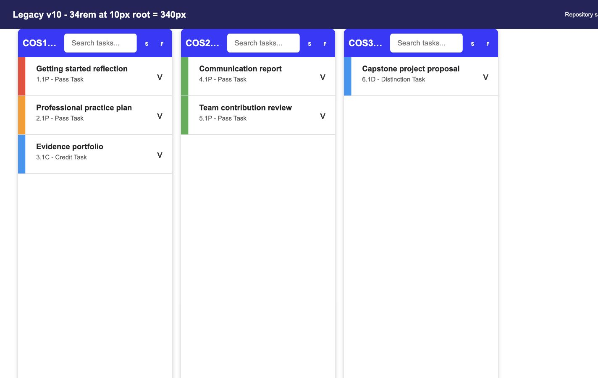
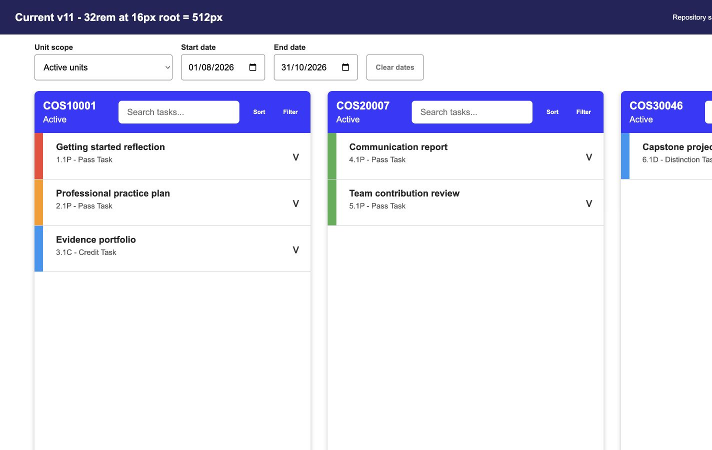
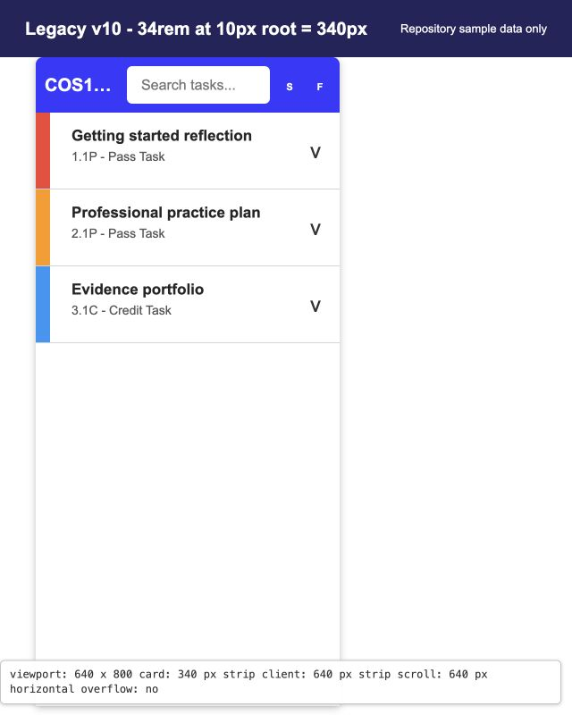
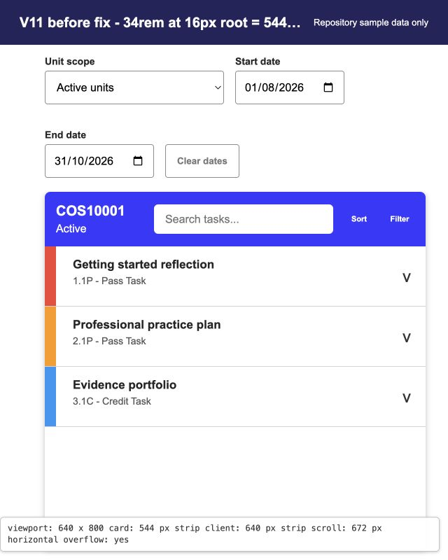
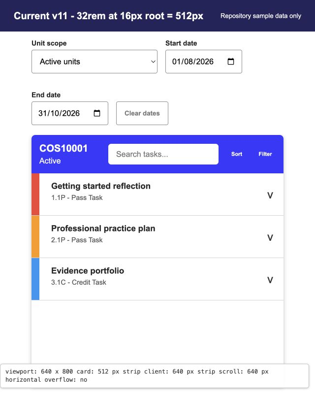
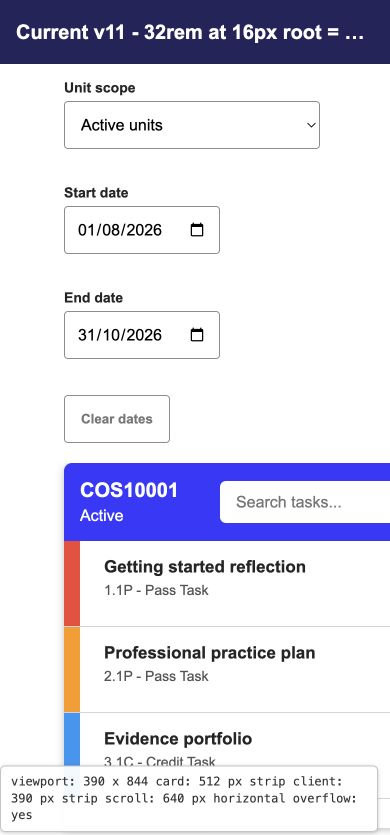
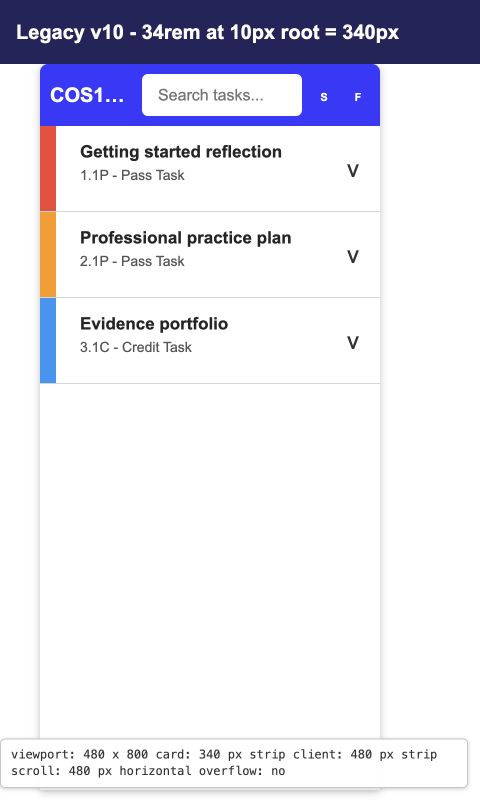
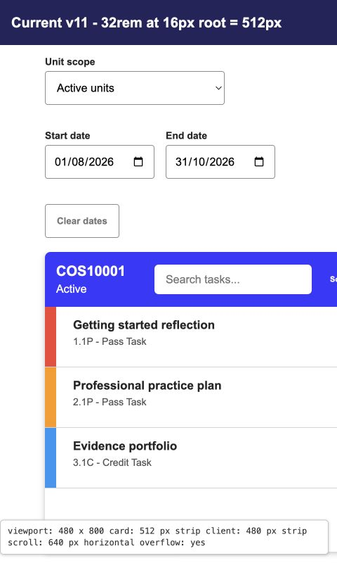

# CPD sizing investigation

Ticket: [CPD - Investigate sizing issue](https://teams.microsoft.com/l/entity/com.microsoft.teamspace.tab.planner/planner.v1.df787fb0-1a0b-4bb5-9bc9-9b92a428eb13_p_KuipOoIL0E-7orl64gLd0cgAGv3z?tenantId=d02378ec-1688-46d5-8540-1c28b5f470f6&webUrl=https%3A%2F%2Ftasks.teams.microsoft.com%2Fteamsui%2FpersonalApp%2Falltasklists&context=%7B%22subEntityId%22%3A%22%2Fv1%2Fplan%2FKuipOoIL0E-7orl64gLd0cgAGv3z%2Fview%2Fboard%2Ftask%2FhHsrVI-btk62f51L1DisTMgAOioK%22%2C%22channelId%22%3A%2219%3Abd20175d09414f079490a2403f7fca74%40thread.tacv2%22%7D)

Status: Investigation complete. An initial responsive sizing adjustment was implemented by CPD-Q04 in [PR #34](https://github.com/ontrack-features-t2-2026/doubtfire-web/pull/34). The phone-layout follow-up recorded below supersedes the original recommendation to retain horizontal scrolling below 640 px.

## Superseding phone layout (2026-08-28)

The Cross-Project Dashboard now changes navigation model below the established 640 px one-card containment threshold:

- Unit scope and global task search stay first, followed immediately by project summaries.
- Status, grade and date controls move into a labelled `More filters` disclosure on phones. An active-filter count keeps hidden criteria discoverable.
- Projects become a full-width vertical accordion. Each collapsed summary exposes the unit name and state, matching task count, and nearest actionable deadline or warning.
- Expanding a project reveals its existing task search, sort, filter and task rows. Only one project is expanded at a time.
- The accordion and filter disclosures use native buttons, 48 px minimum targets, keyboard focus indicators, `aria-expanded`, and `aria-controls` relationships.
- Widths are fluid down to 320 px; phone content is contained without horizontal panning. The existing 512 px cards, horizontal project strip and independently scrolling task lists remain unchanged at 640 px and wider.
- Task titles are keyboard-focusable links, and expanded task actions wrap instead of overflowing a narrow row.

Focused component evidence covers the disclosure state, active-filter count, single-open accordion behavior, summary contents, unique controlled regions, non-duplicated task rows, 320 px-safe utility classes, and retained desktop utility classes. The historical 390 px images below remain useful before-state evidence; they no longer describe the implemented phone behavior.

## Scope

This report explains why the Cross-Project Dashboard (CPD) became noticeably larger when its 10.x feature implementation was moved to the 11.x codebase. It records the reproduction, affected dimensions, source and dependency history, existing remediation, remaining limitations, and implementation guidance.

The original investigation did not change CPD production code or CPD-Q04 behavior. The 2026-08-28 follow-up does change the sub-640 px presentation as documented above; the historical analysis below is retained to explain the sizing boundary and earlier evidence.

## Finding

The primary cause was a missed rem-unit migration:

1. The original CPD feature ran on an OnTrack 10.x baseline that loaded Bootstrap 3 after the application styles. Bootstrap 3 set the root font size to 10 px.
2. Commit [`a8ba06c01`](https://github.com/ontrack-features-t2-2026/doubtfire-web/commit/a8ba06c01cd47937249d5780face427143b7dac4) removed Bootstrap. Its commit notes explicitly state that Tailwind spacing, sizing, and font utilities would otherwise render 60 percent larger, so 138 files were rescaled.
3. CPD was still on the separate `Feature/Cross-Unit` history and was not present in that migration.
4. Commit [`2c6d2786e`](https://github.com/ontrack-features-t2-2026/doubtfire-web/commit/2c6d2786e) later reintroduced the legacy CPD template onto the 11.x base with the same rem-based width and spacing classes. With the browser default 16 px root, those values rendered 60 percent larger.

For example, the legacy `w-[34rem]` card was 340 px under the 10 px root. The same 34 rem value became 544 px under the 16 px root. This is a 204 px, or 60 percent, increase before CPD-Q04.

The Angular Material upgrade and later toolbar controls increased the amount of space needed inside the card header, but they did not cause the uniform 60 percent increase. Tailwind also did not redefine 34 rem: the root font-size context changed.

A secondary height issue has the same migration boundary. Commit [`edab0928c`](https://github.com/ontrack-features-t2-2026/doubtfire-web/commit/edab0928c3419cb7babb3363cc1c2046decb3c0b) deleted the `.panel-full-screen` rule, including its viewport-height constraint. CPD still applies that class, so it is now a no-op. The remaining `h-full` has no explicitly sized route parent and does not reliably constrain the task list to the viewport. This can make the dashboard feel vertically oversized, although it is separate from the uniform width and spacing increase.

## Baselines and ownership

| Baseline                   | Commit                                                                                                                   | Package context                                                    | Purpose                                                                                                                                  |
| -------------------------- | ------------------------------------------------------------------------------------------------------------------------ | ------------------------------------------------------------------ | ---------------------------------------------------------------------------------------------------------------------------------------- |
| Plain 10.0.x               | [`c57c1c320`](https://github.com/ontrack-features-t2-2026/doubtfire-web/commit/c57c1c3206073f7b45fba69eefe9875985a4bee9) | 10.x                                                               | Does not contain CPD and cannot be used as a visual CPD baseline.                                                                        |
| 10.x CPD feature           | [`187902747`](https://github.com/ontrack-features-t2-2026/doubtfire-web/commit/187902747adb3a851bd3294b97b2a9d4a6e8ca95) | `10.0.1-29`, Bootstrap 3.4, Angular Material 17.3.10, Tailwind 3.3 | Valid legacy CPD baseline. Its merge base with 10.0.x is `c57c1c320`.                                                                    |
| 11.x CPD reintroduction    | [`2c6d2786e`](https://github.com/ontrack-features-t2-2026/doubtfire-web/commit/2c6d2786e)                                | `11.0.0-45`, no Bootstrap, Angular Material 22.0.2, Tailwind 4.3.1 | Reintroduced the legacy class values after the repository-wide rescaling.                                                                |
| 11.x before CPD-Q04        | [`b9386055`](https://github.com/ontrack-features-t2-2026/doubtfire-web/commit/b9386055)                                  | 11.x                                                               | Reproduction baseline immediately before the responsive sizing adjustment.                                                               |
| CPD-Q04 implementation     | [`854f9ce9b`](https://github.com/ontrack-features-t2-2026/doubtfire-web/commit/854f9ce9ba5f100b0425996c3f5d7e248faa6b32) | 11.x                                                               | Existing production remediation by SandilBandara in PR #34.                                                                              |
| Investigation snapshot     | [`53f1c5532`](https://github.com/ontrack-features-t2-2026/doubtfire-web/commit/53f1c5532eefc75cadf7834748a5a85c2bc6b3e8) | 11.x                                                               | Source snapshot used for the measurements and original investigation.                                                                    |
| Docs-only replacement base | [`9962e7ea1`](https://github.com/ontrack-features-t2-2026/doubtfire-web/commit/9962e7ea171a2bf6d7a12be50874fa5c7ee77e21) | 11.x                                                               | Current `feature/cross-unit` base used to re-home the report. The relevant sizing classes are unchanged from the investigation snapshot. |

## Reproduction

1. Check out `187902747` in an isolated worktree and inspect `angular.json`, `package.json`, and `src/app/dashboard/f-cross-dashboard.component.html`.
2. Confirm that Bootstrap 3.4 is loaded after `src/styles.scss`, the CPD card uses `w-[34rem]`, the search field uses `w-64`, and the dashboard strip uses `gap-8 px-16`.
3. Check out `b9386055` in a second isolated worktree. Confirm that Bootstrap is absent and that the corresponding pre-fix values are `w-136`, `w-64`, `gap-8`, and `px-16`.
4. Render the dashboard with the same synthetic units and tasks at 100 percent browser zoom. Record computed styles at 1440 x 900, 1280 x 900, 1024 x 900, 768 x 900, 640 x 800, and 390 x 844.
5. Repeat against `854f9ce9b` or the current `feature/cross-unit` branch to verify the CPD-Q04 adjustment.

The included standalone evidence harness reconstructs only the relevant CPD dimensions and uses synthetic data. It makes no network or API requests. The application-level images from PR #34 use the same privacy-safe principle. A live application render additionally requires a compatible local API and an authenticated synthetic student session.

## Measurements

The values below assume the original 10 px root and the current browser-default 16 px root documented above.

| Element or utility       |    10.x CPD feature | 11.x before CPD-Q04 |    Difference | Current after CPD-Q04 |
| ------------------------ | ------------------: | ------------------: | ------------: | --------------------: |
| Unit card                |    `34rem` = 340 px |    `34rem` = 544 px | +204 px, +60% |      `32rem` = 512 px |
| Search field             |    `16rem` = 160 px |    `16rem` = 256 px |  +96 px, +60% |      `14rem` = 224 px |
| Side padding, each side  |      `4rem` = 40 px |      `4rem` = 64 px |  +24 px, +60% |                 64 px |
| Gap between cards        |      `2rem` = 20 px |      `2rem` = 32 px |  +12 px, +60% |                 32 px |
| Card-header padding      |      `1rem` = 10 px |      `1rem` = 16 px |   +6 px, +60% |                 16 px |
| `text-xl` reference size | `1.25rem` = 12.5 px |   `1.25rem` = 20 px | +7.5 px, +60% |                 20 px |

The same unconverted scale remains in the task rows and expanded details:

| Legacy-derived utility              | 10.x rendering | Current rendering | Increase |
| ----------------------------------- | -------------: | ----------------: | -------: |
| `w-4` task rail                     |          10 px |             16 px |     +60% |
| `mr-6` task margin                  |          15 px |             24 px |     +60% |
| `py-4` row padding, each side       |          10 px |             16 px |     +60% |
| `size-8` comment badge              |          20 px |             32 px |     +60% |
| `text-xl` badge text                |        12.5 px |             20 px |     +60% |
| `gap-2` and `pt-2` expanded spacing |           5 px |              8 px |     +60% |

Containment thresholds for one card are:

- 10.x CPD feature: 40 + 340 + 40 = 420 px.
- 11.x before CPD-Q04: 64 + 544 + 64 = 672 px.
- Current after CPD-Q04: 64 + 512 + 64 = 640 px.

At a 640 px viewport, the legacy layout had 220 px of spare horizontal space, the 11.x pre-fix layout overflowed by 32 px, and the CPD-Q04 layout fits exactly. At the historical investigation snapshot, a 390 px fixed-width card overflowed by 250 px and used horizontal scrolling. The 2026-08-28 follow-up supersedes that narrow behavior with full-width stacked summaries below 640 px.

CPD-Q04 reduced the pre-fix card by 32 px (5.9 percent) and the search field by 32 px (12.5 percent). It also changed the unit-scope selector from fixed `w-64` to `w-full max-w-64`, allowing the selector to shrink while retaining its 256 px maximum.

## Visual evidence

### True 10.x and 11.x scale comparison

The following privacy-safe reconstructions use the exact root-size context and component utility values from each source baseline.

### Narrow viewport threshold

At 480 x 800, the legacy one-card footprint fits while the current one-card footprint overflows by 160 px:

The complete application-level CPD-Q04 before and after capture set is also stored in [`docs/evidence/cpd-sizing-investigation`](evidence/cpd-sizing-investigation/README.md) for the 1440, 1280, 1024, 768, and 390 px viewport widths.

## Affected source and dependencies

The affected legacy-derived sizing values span three CPD templates.

[`f-cross-dashboard.component.html`](../src/app/dashboard/f-cross-dashboard.component.html):

- The unit-scope selector is fluid with a 256 px maximum.
- At 640 px and wider, the fixed horizontal card strip retains 32 px gaps, 64 px side padding, and horizontal scrolling between 512 px cards.
- Below 640 px, the strip becomes a vertically scrolling, full-width accordion with 16 px side padding and no horizontal panning.
- The desktop task-search field remains 224 px; the expanded phone control uses the available card width.
- The sort and filter controls use Angular Material icon buttons. Their larger accessible control footprints are a secondary header-space constraint and should not be globally reduced to solve this local issue.

[`dashboard-list-item.component.html`](../src/app/dashboard/list-item/dashboard-list-item.component.html):

- `mr-6`, `ml-2`, and `gap-4` control row spacing.
- `w-4` controls the task rail and `py-4` controls row padding.
- `size-8` and `text-xl` control the comment badge and its text.

[`expanded-list-item.component.html`](../src/app/dashboard/list-item/expanded-list-item/expanded-list-item.component.html):

- `mr-6`, `w-4`, `pb-4`, `pt-2`, and `gap-2` control expanded-row spacing.

Related history and context:

- `angular.json` at the 10.x feature baseline loaded Bootstrap CSS after the application styles.
- `package.json` moved from Bootstrap 3.4, Angular Material 17.3.10, and Tailwind 3.3 to no Bootstrap, Angular Material 22.0.2, and Tailwind 4.3.1.
- Commit [`edab0928c`](https://github.com/ontrack-features-t2-2026/doubtfire-web/commit/edab0928c3419cb7babb3363cc1c2046decb3c0b) removed the old `.panel-full-screen` height rule. The `$main-view-max-height` token still exists in `styles.scss`, and the current inbox applies the equivalent calculated height directly.

## Original recommendation and handover

SandilBandara's CPD-Q04 change in PR #34 safely addressed the immediate 11.x overflow threshold without changing behavior:

- Keep the unit-scope selector fluid up to its existing maximum.
- Keep the local card and search reductions from `w-136` to `w-128` and `w-64` to `w-56`.
- Preserve the horizontal card strip at and above 640 px, search behavior, grade and date filtering, warning states, and Material touch targets.
- Do not apply a global root-font, Tailwind scale, or Angular Material density override for this local dashboard issue.

The investigation shows that PR #34 was a partial remediation rather than a restoration of the 10.x visual scale. If parity with 10.x is still required, hand CPD-Q04 or a follow-up ticket these scoped implementation options:

1. Apply the repository's 0.625 conversion to legacy-derived CPD spacing in all three templates. Examples include `gap-8` to `gap-5`, `px-16` to `px-10`, `gap-4` and `p-4` to `gap-2.5` and `p-2.5`, `mr-6` to `mr-3.5`, `w-4` to `w-2.5`, and `size-8` to `size-5`.
2. Decide the card target explicitly. Exact historic parity is 340 px for the card and 160 px for search. Preserving the relative CPD-Q04 reductions under the corrected scale produces 320 px and 140 px. Either compact target requires the header to reflow because the new Material icon buttons must retain their accessible touch targets.
3. Replace the dead `panel-full-screen h-full` assumption with an explicit viewport-bounded height such as the calculated height already used by the inbox, together with `min-h-0 overflow-hidden`.
4. Preserve the horizontal card strip at and above 640 px, search behavior, grade and date filtering, warning states, and Material touch targets.
5. Add focused privacy-safe regression coverage when making phone-width full-card containment a requirement. The 2026-08-28 follow-up implements that scoped change and records its component evidence above.

The 2026-08-28 production follow-up preserves the authorship and implementation history in PR #34 while superseding only its sub-640 px navigation behavior.

## Risks

- Reducing the card further can crowd the unit title, search field, and two Material icon buttons.
- Making cards fluid on phones changes the horizontal multi-unit navigation model; this is contained below 640 px and covered by accessible native disclosure controls.
- Changing the global rem baseline or Material density would affect unrelated screens and touch targets.
- Removing horizontal overflow without a replacement layout could make additional units inaccessible.
- Removing `.panel-full-screen` without checking the older project dashboard could introduce a vertical layout regression.

## Verification completed

- Compared the 10.x feature, 11.x reintroduction, pre-fix, production fix, and current shared branch histories.
- Verified the Bootstrap removal commit and its explicit 60 percent rescaling rationale.
- Calculated the relevant rem-to-pixel values and one-card containment thresholds.
- Reviewed privacy-safe evidence at the specified desktop, tablet, and phone widths.
- Confirmed that the docs-only replacement changes no source, configuration, or CPD behavior.
- Ran the repository lint, typecheck, full test, and production build checks recorded with the evidence.
- Added focused 2026-08-28 tests for the phone filter disclosure, active-filter indicator, unit summaries, accordion state, accessible control relationships, single task-row rendering, and responsive width contract.
