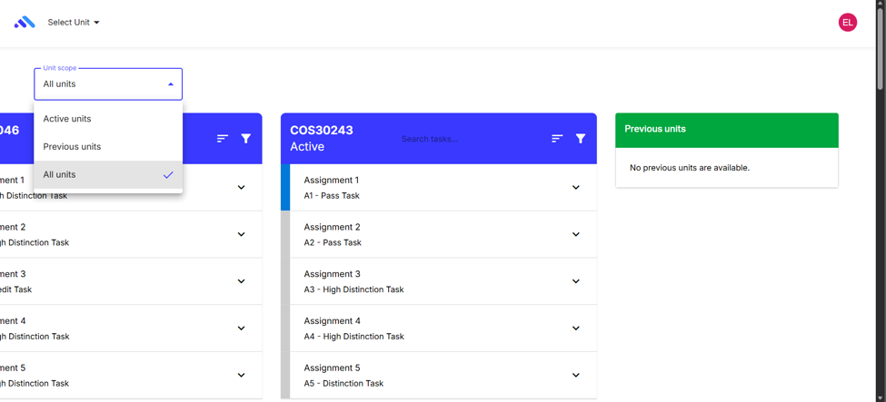
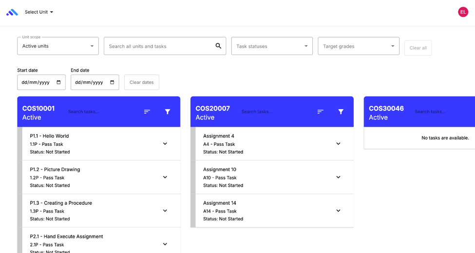

# Cross-Project Dashboard: User Guide & Contributor Handover

This document is the user guide for students using the Cross-Project Dashboard and a handover reference for contributors maintaining the feature on `11.0.x`. The historical `feature/cross-unit` work is already integrated into that release line.

---

## Part 1: Student User Guide

### 1. Unit Scopes

The dashboard allows students to filter visible projects using the **Unit scope** dropdown.

- **Active units:** Displays currently enrolled and active projects.
- **Previous units:** Displays authorised projects from past teaching periods. If no historical data exists, a "No previous units are available" message is displayed.
- **All units:** Combines active and previous authorised projects in one view.

### 2. Searching and Filtering

The dashboard features a global toolbar to filter tasks across all visible units.

- **Global search:** Matches unit code/name and task title, abbreviation, status, target grade or due date across visible units.
- **Per-unit search:** Matches a task's title, subtitle, description, abbreviation or status inside one unit card.
- **Task statuses:** Filters by any task state offered in the dropdown.
- **Target grades:** Filters by Pass, Credit, Distinction or High Distinction tiers.
- **Date filters:** Start and end date fields filter tasks by their local due date. An invalid range is announced and is not applied.
- **Clear controls:** "Clear all" restores the Active-units scope and resets all global toolbar filters, including dates. "Clear dates" resets only the date range. Per-unit search and card filters remain independent.
- **Empty states:** The dashboard distinguishes between no available tasks and no tasks matching the current filters.

### 3. Phone Layout

On screens narrower than 640 px, the dashboard uses a stacked layout designed
for touch and keyboard use rather than a horizontally scrolling row of unit
cards.

- The unit scope and global search stay at the top of the page.
- Secondary filters move into a **More filters** disclosure. Its label includes
  the number of active secondary filters so hidden filter state remains visible.
- Projects become full-width disclosures, and opening one project closes the
  previously open project. Each closed header still shows the unit, project
  state, matching-task count and nearest actionable deadline.
- Task actions wrap within the viewport. The page must not require horizontal
  panning at supported phone widths down to 320 px.

At 640 px and wider, the desktop/tablet layout remains a horizontally arranged
set of independently scrolling unit cards, with the full filter toolbar visible.

### 4. Grade Completion Summaries

When one or more target-grade filters are selected, each visible unit card displays a **Grade task completion** summary for those tiers.

- It displays counts and percentages, such as "Pass: 1 of 3 complete (33%)".
- These percentages represent _task completion counts_ for the selected tier. They are **not** predicted final grades or official academic marks.

### 5. Due Date Warnings & Limitations

The dashboard provides visual urgency indicators for approaching task deadlines.

- **Overdue:** Displayed in red.
- **Within 24 hours:** Displayed in orange.
- **Within 3 days:** Displayed in yellow.
- **Within 7 days:** Displayed in blue.

Warnings are shown only for tasks that have not been submitted. The dashboard uses `Task.localDueDate()`, which prefers the task-specific due date supplied by the API before falling back to the task definition. The dashboard does not independently grant or calculate extensions; the project record remains the authoritative deadline source.

### 6. Accessibility

- **Keyboard navigation:** Filter controls and task-detail toggles are keyboard operable, and per-unit search controls have visible focus styling.
- **Project disclosures:** Phone project headers expose their expanded state,
  keep a visible focus indicator and preserve focus when filters are cleared.
- **Screen readers:** Task-detail buttons expose their expanded state and use task-specific Expand/Collapse labels. Decorative warning icons are hidden from assistive technology.
- **Non-colour meaning:** Due warnings include visible text such as "Overdue" or "Due within 3 days", so colour is not the only signal.

### 7. Authorized Data Boundary (Privacy)

The Cross-Project Dashboard uses the authenticated student's authorised project and task responses.

- It displays task statuses, local due dates and definitions only for projects returned to that student by the API.
- It does not introduce official numerical marks, staff feedback comments or peer-assessment information.

---

## Part 2: Contributor Handover

### 1. Architecture & Key Files

- **Target branch:** `11.0.x`
- **Main component:** `src/app/dashboard/f-cross-dashboard.component.ts` handles unit scopes, global and per-unit filtering, grade completion summaries, previous-unit loading and the single-open phone disclosure state.
- **Main template:** `src/app/dashboard/f-cross-dashboard.component.html` defines the filter toolbar, responsive project disclosures/cards and empty/error states.
- **Responsive styling:** `src/app/dashboard/f-cross-dashboard.component.scss` switches the stacked phone experience at 640 px while retaining the wider horizontal card layout.
- **Due-warning component:** `src/app/dashboard/list-item/dashboard-list-item.component.ts` owns warning thresholds and labels.
- **Test suites:** The adjacent component specs cover unit scopes, global/per-unit search, status/grade/date filters, summaries, warnings and accessibility state.

### 2. Linked Tickets & Context

- **CPD-F04:** Local frontend date-range filtering alongside unit scopes and existing task data.
- **CPD-F05:** Accessible global-toolbar date controls and targeted tests.
- **CPD-Q03:** Accessible due-date warning badges in the dashboard task presentation.
- **CPD-Q04:** Responsive-sizing regression coverage and visual evidence.
- **CPD-Q05:** UI comparison and acceptance evidence; keep the evidence link with the ticket rather than treating this guide as the comparison matrix itself.

### 3. Known Gaps & Post-MVP Work

The following limitations remain post-MVP work:

1. **Deadline source:** Web displays the local due date supplied through the task model. Any new extension representation must be added to the API/model contract before the dashboard can display it.
2. **Visualisation scale:** High task volumes can create substantial scrolling. Adaptive scale controls or compact toggles remain a possible follow-up.
3. **Filter persistence:** Global toolbar filters reset after a page refresh; no account-level filter preference is stored.

### 4. Verification Basis

This guide was reconciled with the merged `11.0.x` implementation after the Cross-Project Dashboard closure and phone-layout merges. The two screenshots show the wider toolbar using demonstration units and contain no real student records. Before changing the guide, rerun the dashboard-focused component specs, verify the screenshots still match the current wider toolbar and unit-scope labels, and check computed layout at 320 px, 390 px, 640 px and a desktop width.
