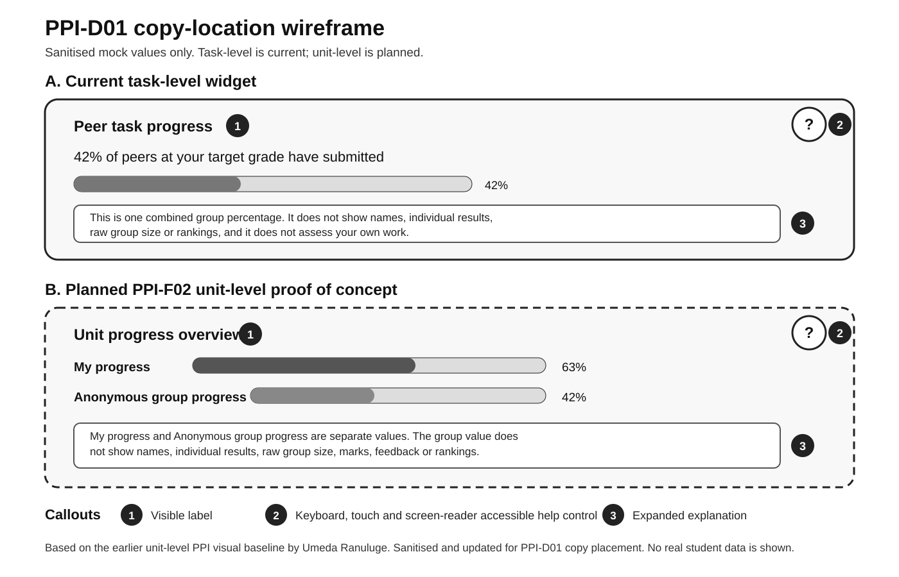

# PPI-D01: Peer Progress Help Text and Privacy Copy

**Ticket:** PPI-D01 - Write the peer-comparison explanation, privacy limits and help text
**Branch:** `docs/ppi-help-privacy`
**Scope:** Documentation and copy specification only. No production widget logic, API
behaviour or data flow is changed by this document.

**Implementation status:**

- The task-level location map is based on the current PPI widget.
- The unit-level copy is planned for the mock-backed PPI-F02 proof of concept.
- The unit-level section does not claim that a live unit-level component or API already
  exists.
- Labels, help controls and expanded explanations still require a separate frontend
  implementation.

## Acceptance criteria coverage

| Requirement                                                             | Result | Evidence                                                             |
| ----------------------------------------------------------------------- | ------ | -------------------------------------------------------------------- |
| Label, tooltip and expanded explanation for the task-level view         | Met    | Section 3                                                            |
| Label, tooltip and expanded explanation for the planned unit-level view | Met    | Section 4                                                            |
| Explain that the result is an anonymous aggregate and not a ranking     | Met    | Section 1 and all visible-value states                               |
| Cover suppression, unavailable and stale data                           | Met    | Sections 3 and 4                                                     |
| Use plain language without shame or pressure                            | Met    | All copy avoids ahead, behind, winning, losing and judgement wording |
| Map copy to exact current or planned UI locations                       | Met    | Section 2                                                            |
| Include one annotated screenshot or wireframe                           | Met    | `assets/ppi/ppi-d01-copy-location-wireframe.svg`                     |

## 1. Shared privacy and wellbeing rules

These rules apply to both views:

1. A group result is shown as one combined percentage.
2. It must not display names, student IDs, project IDs, individual results, individual
   task statuses, marks, feedback, raw group size or rankings.
3. A displayed `0%` is a real privacy-bucket value. It must not be presented as missing,
   suppressed or unavailable data, but it may represent a small percentage that rounds to zero.
4. A suppressed result explains that the group value is hidden for privacy without
   revealing the exact group size.
5. Unavailable and stale states describe a data or timing condition. They must not sound
   like feedback about the student's own work.
6. The wording must not describe the student as ahead, behind, better or worse than
   anyone else.
7. The percentage is not a predicted grade or a judgement about the student's chance of
   receiving a grade.
8. Student-facing text must not expose technical errors, internal identifiers or backend
   details.

This wording describes the intended display boundary. Backend authorisation, aggregation
and small-group suppression must still enforce that boundary.

## 2. Copy placement and accessibility

### 2.1 Current task-level location

- **Widget template:** `src/app/projects/states/dashboard/directives/task-dashboard/directives/task-description-card/ppi-widget/ppi-widget.component.html`
- **Parent mount location:** `src/app/projects/states/dashboard/directives/task-dashboard/directives/task-description-card/task-description-card.component.html`
- **State resolver:** `src/app/api/models/peer-progress-indicator-state.ts`
- **Current screen location:** inside the task description card, after the task date
  controls.
- **State locations:** use the durable template cases rather than relying only on line
  numbers:
  - `@case ('success')`
  - `@case ('no-data')`
  - `@case ('hidden')`
  - `@case ('unavailable')`
  - `@case ('stale')`
  - `@case ('disabled')`

The task-level copy should use the three numbered locations in the wireframe:

1. A visible label naming the information.
2. A short tooltip or help summary opened from an accessible help control.
3. An expanded explanation in a popover, panel or other accessible disclosure.

### 2.2 Planned unit-level location

The unit-level copy is planned for the PPI-F02 mock-backed proof of concept. It should use
the same three locations:

1. **Label:** at the top of the unit progress summary card.
2. **Tooltip or short help text:** opened from the card's help control.
3. **Expanded explanation:** below the two progress values or inside an accessible
   disclosure panel.

The planned card should keep these values separate:

- **My progress**
- **Anonymous group progress**

The earlier unit-level wireframe used one anonymous Ready-for-Feedback value. The current
PPI-F02 scope requires the student's own progress and the anonymous group value to be
separately labelled. The annotated wireframe below keeps the earlier simple card style
while showing the current two-value boundary.

### 2.3 Accessibility requirement for implementation

The future help control must:

- be a real button with a useful accessible name;
- work with keyboard, touch, and screen-reader use;
- not depend on mouse hover alone;
- expose expanded text in a predictable reading and focus order;
- close without trapping keyboard focus;
- remain understandable without colour;
- avoid using an icon as the only explanation.

Suggested accessible name:

> About peer progress

## 3. Task-level copy

### 3.1 Normal result

**Template state:** `@case ('success')`

- **Label:** Peer task progress
- **Tooltip or short help text:** Shows the percentage of students in your
  privacy-protected target-grade group who have submitted this task.
- **Expanded explanation:** This is one combined percentage for students aiming for the
  same target grade. It does not show names, individual results, raw group size or
  rankings. It does not assess your own work or predict your grade.

### 3.2 Rounded zero result

**Template state:** `@case ('no-data')`

- **Label:** Peer task progress
- **Tooltip or short help text:** The privacy-protected group percentage currently rounds
  to 0%. This is a displayed value, not missing data.
- **Expanded explanation:** The API rounds percentages into privacy-safe bands, so 0% may
  include a small number of submissions. It is not feedback about your own progress. The
  displayed percentage may change as submissions are made.

### 3.3 Small-group suppression

**Template state:** `@case ('hidden')`

- **Label:** Peer task progress hidden
- **Tooltip or short help text:** The group percentage is hidden because the group is too
  small to show safely.
- **Expanded explanation:** OnTrack hides the group percentage to protect student
  privacy. It does not show the hidden value, exact group size, names or individual
  results. This is a privacy safeguard, not an error or a judgement about your work.

### 3.4 Unavailable data

**Template state:** `@case ('unavailable')`

- **Label:** Peer task progress unavailable
- **Tooltip or short help text:** Current group progress is not available. This does not
  describe your own progress.
- **Expanded explanation:** OnTrack cannot show a current group percentage for this task
  right now. This is a data-availability state, not feedback about your work. Check again
  later.

### 3.5 Stale data

**Template state:** `@case ('stale')`

- **Label:** Peer task progress not current
- **Tooltip or short help text:** The group value has not refreshed recently, so it is not
  shown as current.
- **Expanded explanation:** The latest group percentage may be out of date. OnTrack does
  not present it as current because that could be misleading. This is a timing issue, not
  feedback about your own progress.

### 3.6 Feature disabled

**Template state:** `@case ('disabled')`

- **Label:** Peer task progress off
- **Tooltip or short help text:** Peer progress is turned off for this unit.
- **Expanded explanation:** Peer comparison is not shown for this unit. This message only
  describes whether the feature is available. It is not a judgement about your work,
  submission or progress.

### 3.7 Supporting loading and error copy

These states already exist in the task-level widget and should use the same accessible
help pattern when the copy is implemented.

- **Loading:** Loading peer progress.
- **Error:** Could not load peer progress. Please try again.

The error message must remain generic and must not reveal peer details, internal IDs,
authorisation rules or backend errors.

## 4. Planned unit-level copy

This section is design-ready copy for the mock-backed PPI-F02 proof of concept. It is not a
claim that live unit-level data has been delivered.

### 4.1 Normal result

- **Label:** Unit progress overview
- **Tooltip or short help text:** Shows your own unit progress beside one
  privacy-protected group percentage.
- **Expanded explanation:** My progress and Anonymous group progress are separate values.
  They use the agreed unit-progress measure. The group value is one combined percentage
  and does not show names, individual results, raw group size, marks, feedback or
  rankings.

### 4.2 Rounded zero group result

- **Label:** Unit progress overview
- **Tooltip or short help text:** Anonymous group progress currently rounds to 0%. This is
  a displayed value, not missing data.
- **Expanded explanation:** Your own progress remains separate from the group result. A
  displayed group value of 0% may include a small value that rounds to zero. It is not
  feedback about your work and does not predict your grade.

### 4.3 Small-group suppression

- **Label:** Anonymous group progress hidden
- **Tooltip or short help text:** The group percentage is hidden because the group is too
  small to show safely.
- **Expanded explanation:** Your own progress may still be shown when it is available, but
  the anonymous group percentage is hidden for privacy. OnTrack does not show the hidden
  percentage, exact group size, names or individual results.

### 4.4 Unavailable group data

- **Label:** Anonymous group progress unavailable
- **Tooltip or short help text:** Your own progress may remain visible, but current group
  progress is unavailable.
- **Expanded explanation:** OnTrack cannot show a current anonymous group percentage
  right now. This does not change or assess your own progress. Check again later.

### 4.5 Stale group data

- **Label:** Anonymous group progress not current
- **Tooltip or short help text:** The group value has not refreshed recently and is not
  shown as current.
- **Expanded explanation:** The latest anonymous group percentage may be out of date.
  OnTrack does not present it as current because that could be misleading. Your own
  progress remains a separate value.

### 4.6 Feature disabled

- **Label:** Unit peer progress off
- **Tooltip or short help text:** Peer progress is turned off for this unit.
- **Expanded explanation:** The unit-level peer comparison is not shown. This message only
  describes feature availability. It is not feedback about your work, submission or
  progress.

### 4.7 Supporting loading and error copy

- **Loading:** Loading unit progress.
- **Error:** Could not load unit progress. Please try again.

A failed request or unit change must not leave the previous unit's anonymous group value
visible as though it were current.

## 5. Implementation status and handover

| Item                                              | Status after PPI-D01                                 |
| ------------------------------------------------- | ---------------------------------------------------- |
| Task-level state copy                             | Complete in this document                            |
| Task-level label, help control and expanded panel | Planned frontend implementation                      |
| Unit-level state copy                             | Complete as planned PPI-F02 copy                     |
| Unit-level component                              | Separate PPI-F02 work                                |
| Live unit-level API                               | Future work and not claimed here                     |
| Annotated copy-location evidence                  | Complete in the sanitised SVG wireframe              |
| Privacy and authorisation enforcement             | Separate backend and security testing responsibility |

### Known implementation follow-ups

1. The current task-level template contains a visible message but no dedicated accessible
   help control or expanded explanation location.
2. The genuine zero message is currently handled differently from several other states.
   A frontend follow-up should decide whether all state messages use one consistent
   source.
3. Stale and unavailable states need clearly different visible messages when this copy is
   implemented.
4. The disabled state must remain neutral. The frontend must not claim that a particular
   role or person disabled the feature unless the trusted response explicitly supplies
   that information.
5. The exact unit-progress metric must be confirmed by the implementation and calculation
   tickets before the planned unit-level wording is wired into production.

## 6. Evidence and attribution

- Original PPI-D01 task-level research and copy:
  - David Tenni
  - commits `c98e044` and `c5b379d`
- Earlier unit-level visual baseline and usability work:
  - Umeda Ranuluge
  - used as a design reference without copying personal identifying details
- Acceptance-criteria completion, privacy wording correction, sanitised annotated
  wireframe and handover:
  - Maple Fox
- Documentation:
  - `docs/ppi-help-text-pack.md`
- Annotated wireframe:
  - `docs/assets/ppi/ppi-d01-copy-location-wireframe.svg`
