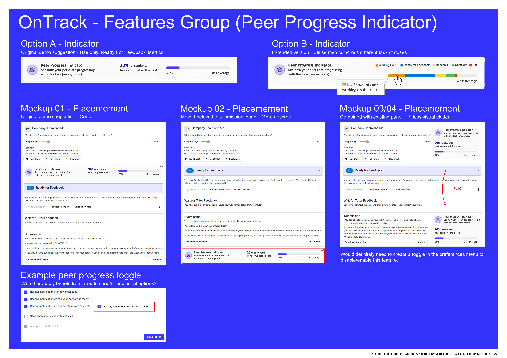
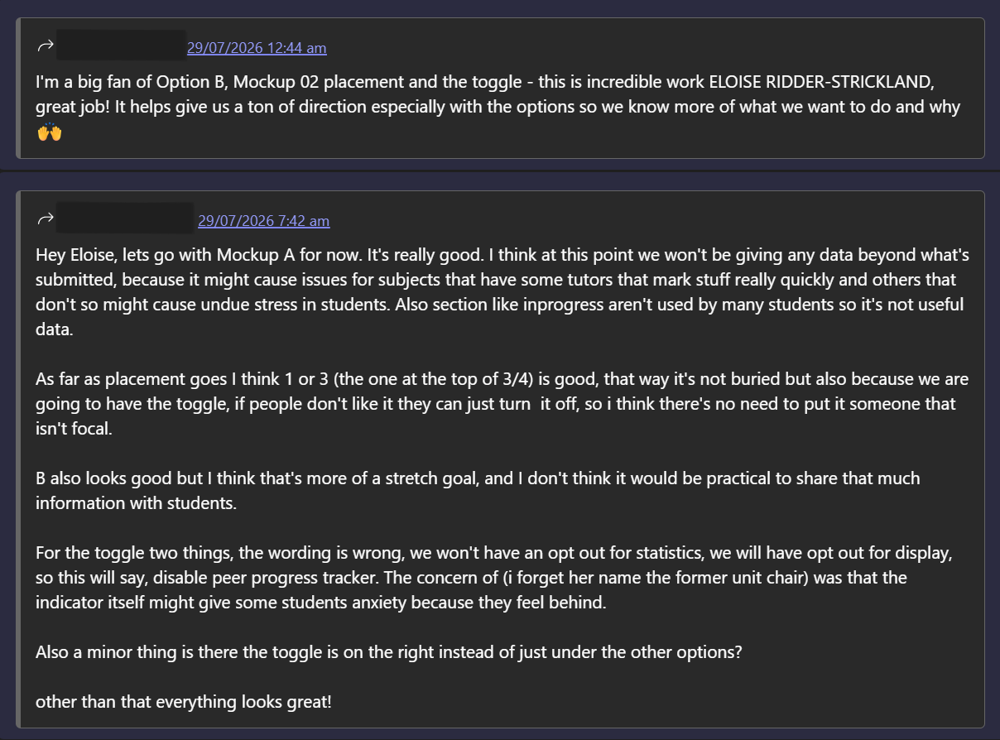
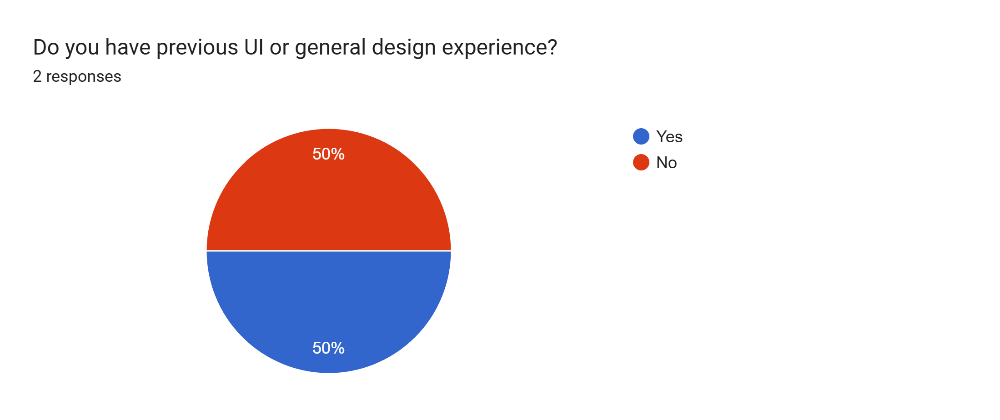

# PPI-D03: Proof of Concept, Feedback and Design Evaluation

**Ticket:** PPI-D03 - Gather feedback and document the task-sheet PPI design decisions
**Branch:** `docs/ppi-task-sheet-widget-feedback`
**Group:** Feature/Peer Progress Indicator
**Resource:** `PPI-task-sheet-widget-v1.png`
**Resource Attribution:** Eloise Ridder-Strickland

**Purpose**
> To identify design recommendations for the development of the Peer Progress Indicator widget, in line with user, stakeholder and project scope/expectations and accessibility, usability and style guidelines.

### Implementation status

*Proof of concept.* This document does not claim that a live unit-level component or API is implemented or already exists. The proposed widget could show an authorised, anonymous cohort aggregate. Live accuracy, refresh timing and the required unit-level data source remain future implementation and validation work.

### Privacy and evidence handling

Reviewer evidence is de-identified. Reviewer names are omitted unless consent to publish them is recorded. The evidence does not include student IDs, marks, student assessment feedback, progress records, credentials, secrets or real student data.

### Acceptance Criteria Coverage

|       | Requirement                                                                                                                          | Result | Evidence                                                                   |
| ----- | ------------------------------------------------------------------------------------------------------------------------------------ | ------ | -------------------------------------------------------------------------- |
| `1.`  | The original ticket, mock-up and author are clearly identified. | *Met* | Header and Section 7. |
| `2.`  | At least two people review the design. A third reviewer is encouraged but not required. | *Met* | Two formal reviewers represented by general roles in Section 2. |
| `3.`  | One reviewer represents implementation or technical knowledge and one represents likely users, tutors, UX or documentation. | *Met* | Section 2. |
| `4.`  | The same core questions are used for each review. | *Met* | Sections 1.2 and 2.1; both formal reviewers answered the same follow-up question. |
| `5.`  | The Markdown file clearly separates reviewer feedback from Eloise's conclusions. | *Met* | Sections 2 and 3. |
| `6.`  | The evidence does not expose student IDs, marks, feedback, progress records or other unnecessary personal information. | *Met* | Privacy statement and de-identified roles in Section 2. |
| `7.`  | The review covers clarity, placement, usefulness, anonymity, accessibility, possible stress or competition, and the user preference. | *Met* | Sections 3 to 5. |
| `8.`  | Each suggested change is marked as accepted, deferred or not adopted, with a short reason. | *Met* | Section 3. |
| `9.`  | Any revised design is optional and does not block completion. | *Met* | Section 6. |
| `10.` | If a revision is made, the original image remains in the repository so the design history is preserved. | *Met* | `docs/images/PPI-task-sheet-widget-v1.png`. |
| `11.` | The documentation does not claim that the design has been implemented or connected to live data. | *Met* | Implementation status and Sections 4 to 6. |
| `12.` | The pull request links the original Planner ticket, this follow-up ticket and the supporting evidence. | *Met* | PR description and Section 7. |

## 1. Methodology

Two formal reviewers evaluated the same mock-up using the same survey question set, including the same follow-up improvement question. Earlier project discussions and general Teams comments were retained as supplementary discovery evidence and were not counted as formal reviews.

### 1.1 Evidence sources

1. **Supplementary discovery discussion** before the mock-up was developed, involving project leadership and mentors: [Ontrack - Sprint Planning (Fortnightly)](https://deakin365.sharepoint.com/:v:/r/sites/ThothTech2/Shared%20Documents/Product%20-%20OnTrack/Recordings/Ontrack%20-%20Sprint%20Planning%20\(Fortnightly\)-20260720_180013-Meeting%20Recording.mp4?d=w0b96f239856c4927b309d448a06b7e8c&csf=1&web=1&e=e0uYqS&nav=eyJyZWZlcnJhbEluZm8iOnsicmVmZXJyYWxBcHAiOiJTdHJlYW1XZWJBcHAiLCJyZWZlcnJhbFZpZXciOiJTaGFyZURpYWxvZy1MaW5rIiwicmVmZXJyYWxBcHBQbGF0Zm9ybSI6IldlYiIsInJlZmVycmFsTW9kZSI6InZpZXcifX0%3D)
2. **Supplementary open group discussion** after the initial mock-up was shared in Teams.

3. **Formal survey review** completed by two reviewers using the same evaluation questions: [Peer Progress Indicator Mock-up Evaluation](https://docs.google.com/forms/d/e/1FAIpQLSeXGCQzNpgdOlEv686l91L1ko58_SnHXD6obsdpx---WXpTzA/viewform?usp=dialog)

### 1.2 Evaluation questions

#### Feedback profile

1. Which feature group are you a part of?
2. Do you have previous UI or general design experience? (Yes/No)

#### Context and design

3. Without context, what do you think the Peer Progress Indicator primarily shows?
4. Which indicator design option is more useful or comfortable to view, and why?
5. ~~Which placement option is more useful or comfortable to view, and why?~~ - *Removed as redundant with Question 6.*
6. Which placement is easiest to notice and understand without cluttering the task sheet?

#### Accessibility and privacy

7. Is it clear that this is an anonymous cohort value rather than a ranking?
8. Is the local show/hide option clear for users who do not want to view peer progress?
9. If this feature were available, would you choose to show or hide it by default?
10. What is the main reason for that preference?

#### General considerations

11. Are there accessibility concerns that are not addressed in the mock-up?
12. Is a local On/Off control appropriate, and could you suggest a better location or label?
13. What is the single most useful improvement you would make? - *Completed as the same follow-up question for both formal reviewers.*

## 2. Aggregated Feedback Summary

The following are de-identified extracts from the two formal survey reviews and supplementary team communications about *PPI-task-sheet-widget-v1.png*.

The formal reviewer roles were:

- A **technical/design reviewer** with relevant implementation or design knowledge.
- A **likely end-user reviewer** representing student usability needs.

Earlier PPI contributor and team discussions were retained as supplementary discovery evidence and were not counted as additional formal reviews.

### 2.1 Common improvement question

Both formal reviewers were asked the same missed question as a follow-up.

- **Technical/design reviewer:** The single most useful improvement I would make is to keep the richer Option B concept, but introduce it gradually rather than showing every task status immediately. I would start with a simple anonymous comparison, keep the Mockup 02 placement, and include a clear show/hide preference. Once the data and behaviour are proven to be accurate and useful, the additional status breakdowns could be added later.
- **Likely end-user reviewer:** The single most useful improvement for me would be giving students clear control over whether the indicator is shown. I like the Mockup 02 placement because it is visible without getting in the way, but I would keep the wording neutral and make it easy to hide so students who find peer comparison distracting or stressful do not have to see it.

| Strength                                                                           | Concerns                                                                                                                                                     | Suggestion                                                                                                                         |
| ---------------------------------------------------------------------------------- | ------------------------------------------------------------------------------------------------------------------------------------------------------------ | ---------------------------------------------------------------------------------------------------------------------------------- |
| Option B - it gives a clearer outline.                                             | Option B - gives a lot more information but could scare people who aren't ready to see a lot of information.                                                 | Option A - with a toggle for Option B called 'Advanced'. for people who would like to see an advanced view (Option B).             |
| Option B - the data is helpful for me.                                             | Option B - could cause issues for subjects that have tutors that mark stuff really quickly and others that don't so it might cause undue stress on students. | An overall dark mode would be very interesting / helpful                                                                           |
| Placement 1 - the information is where you want it when scanning over a page.      | 'InProgress' aren't used by many students so it's not useful data.                                                                                           | Having the Opt-In/Opt-out in the same area as the 'placement' would likely be easier for most/all students as it's simple to find. |
| Placement 1 - does not over cutter the reading space.                              | Option B - I don't think it would be practical to share that much information with students.                                                                 | As far as placement goes I think 1 or 3.                                                                                           |
| Opt-in, because it is useful and clear.                                            | Example Toggle - The wording is wrong, we won't have an opt-out for statistics.                                                                              | Option B - looks good but I think that's more of a stretch goal.                                                                   |
| Opt-in, I'd would like see the data & would want others to benefit off it as well. | The indicator itself might give some students anxiety because they feel behind.                                                                              |                                                                                                                                    |
| It is a good feature and is appropriate.                                           |                                                                                                                                                              |                                                                                                                                    |
| I'm a big fan of Option B, Mock-up 2 placement and the toggle.                     |                                                                                                                                                              |                                                                                                                                    |
| If people don't like it they can just turn it off.                                 |                                                                                                                                                              |                                                                                                                                    |

## 3. Decision Table

Each item is marked as **Accepted**, **Deferred**, or **Not adopted**, with a short reason. Wellbeing concerns are treated as real design risks rather than dismissed because a visibility control exists.

| Status | Reviewer feedback | Design conclusion and reason |
| --- | --- | --- |
| **Accepted** | *Placement 1 - the information is where you want it when scanning over a page.* | Use Placement 1 as the baseline because it is central, easy to notice and contextually relevant. |
| **Accepted** | *Placement 1 - does not overly clutter the reading space.* | Keep the first view compact so the submission workflow remains the main focus. |
| **Accepted** | *If people do not like it they can turn it off.* | Provide a clear local show/hide control beside the widget. This reduces exposure but does not remove the underlying wellbeing risk. |
| **Accepted** | *Option B gives a clearer outline.* | Use this to inform a possible future advanced view while keeping Option A as the simpler baseline. |
| **Accepted** | *'InProgress' is not used by many students, so it is not useful data.* | Exclude this metric from the first proof of concept because reviewers did not identify enough value to justify the extra detail. |
| **Accepted** | *Place the visibility control in the same area as the widget.* | A local control is easier to find and clearly communicates that it hides only the visual widget. |
| **Accepted** | *The example toggle wording suggests an opt-out from statistics.* | Correct the interface wording. Users may show or hide the widget locally; this does not imply opting out of authorised anonymous aggregation. |
| **Accepted as risk** | *Option B could scare people who are not ready to see that much information.* | Valid wellbeing and cognitive-load risk. Start with Option A, avoid ranking language and validate the default visibility before implementation. |
| **Accepted as risk** | *Different tutor marking speeds could create undue stress.* | Valid interpretation risk. Any future implementation needs neutral wording, explanation of data limits and testing across different unit workflows. |
| **Accepted as risk** | *The indicator might make some students anxious because they feel behind.* | Valid wellbeing risk. A show/hide control reduces but does not remove it; the feature needs safe defaults and user testing. |
| **Deferred** | *Add an Advanced option that expands Option A into Option B.* | Useful future extension, but outside the first proof-of-concept scope. |
| **Deferred** | *Add an overall dark mode.* | Potentially useful but outside this feature's scope. Existing OnTrack accessibility and theme work should be considered separately. |
| **Deferred** | *Option B looks good but is a stretch goal.* | Retain as a future option after the simple baseline and data contract are validated. |
| **Not adopted** | *It is a good feature and is appropriate.* | Positive but too general to create a separate design action. |
| **Not adopted** | *Option B data is helpful to me.* | Recorded as useful feedback, but one personal preference does not justify making the detailed view the default. |
| **Not adopted** | *I would show it because it is useful and clear.* | Supports perceived usefulness but does not create a separate design change. |
| **Not adopted** | *Option B is not practical to share with students.* | Addressed through the simpler Option A baseline and the deferred advanced view rather than rejecting the whole concept. |
| **Not adopted** | *Placement 1 or 3.* | Too broad to act on directly; the more specific placement feedback supports Placement 1. |
| **Not adopted** | *I would show it and want others to benefit from it.* | Recorded as a preference, but it does not determine the default for all students. |

## 4. Impact Consideration Summary

| Area | Functional considerations | Non-functional considerations |
| --- | --- | --- |
| **Clarity** | Option A provides a simple baseline. Option B adds a detailed stage breakdown and may be considered later. | Reduce visual clutter, use neutral wording and clearly explain that the value is an anonymous cohort aggregate rather than a ranking. |
| **Placement** | Consider Placement 1 as the initial design, with the local show/hide control beside the widget. | Keep the primary task submission workflow central and place the indicator near related information. |
| **Usefulness** | The proposed widget could show an authorised, anonymous aggregate comparison. Live accuracy, refresh timing and the required data source still need implementation and validation. | The feature may support pacing and reassurance, but it must not imply that cohort progress determines an individual student's success. |
| **Anonymity** | Use aggregated percentage metrics and prevent access to individual student records. | Protect psychological safety and test authorisation so users cannot infer or access another student's progress. |
| **Accessibility** | Provide accessible text equivalents, screen-reader labels and keyboard operation for controls and tooltips. | Do not rely on colour alone. Use sufficient contrast, patterns or labels, and test the design with accessibility tooling and users where possible. |
| **Wellbeing** | Give users a clear local show/hide control and avoid ranking or competitive language. | Seeing peer completion rates may create stress, competition or a false sense of security. The control reduces but does not remove these risks. |
| **User preference** | Allow students to show or hide the widget locally without implying that they can opt out of authorised anonymous aggregation. | Use a considered default, preserve user agency and minimise sensitive information shown outside the main OnTrack context. |

## 5. Summary of Findings

Based on the available feedback, the first proof-of-concept direction should include:

- **Placement 1:** It places the information where students naturally scan while keeping it near the relevant task context.
- **Option A as the baseline:** Option B received positive feedback, but Option A is a more realistic first step. A detailed advanced view can remain future work.
- **Local show/hide control:** Place the control on or beside the widget. Make it clear that this controls local visibility only.
- **Neutral and accessible wording:** Explain that the value is anonymous and is not a ranking. Avoid competitive language and do not expose individual student information.
- **Focused metrics:** Omit `InProgress` from the first proof of concept because the reviewers did not identify enough value to include it.
- **Wellbeing safeguards:** Treat stress, anxiety, tutor marking-speed differences and false reassurance as design risks that require safe defaults and validation.

Avoid:

- **Placement 2 as the initial choice:** The specific feedback more strongly supports Placement 1.
- **Global statistical opt-out wording:** The local control hides the widget; it does not imply an opt-out from authorised anonymous aggregation.
- **Mandatory persistent display:** A forced view could negatively affect some students and removes user agency.
- **Claims of live or real-time accuracy:** No live unit-level data source or implemented widget is claimed in this document.

### Implementation notes

> **User agency and wellbeing:** Put a binary show/hide control directly on or beside the widget and validate the default before implementation.

> **Data and security:** Use authorised aggregate metrics, filter out irrelevant statuses, minimise exposed information and test access controls.

> **Accessibility:** Provide high-contrast visual cues, text equivalents, screen-reader labels, keyboard operation and clear tooltips where applicable.

> **Validation:** Test comprehension, accessibility, privacy, different tutor marking patterns and possible stress effects before treating the design as production-ready.

## 6. Handover and Recommendations

1. **Implement Option A only as a future baseline**, keeping Option B or an Advanced View as a later stretch goal after the data source and user need are validated.
2. **Use correct interface wording:** state that the control shows or hides the visual widget locally rather than suggesting an opt-out from authorised anonymous aggregation.
3. **Prototype Placement 1:** place the compact widget and local control near the task context, then test that it does not interfere with submission work.
4. **Define the data contract and security boundary:** document the authorised aggregate fields, refresh behaviour, cohort rules, suppression thresholds and access-control tests before connecting live data.
5. **Validate accessibility and wellbeing:** test neutral wording, keyboard and screen-reader support, colour independence, default visibility and responses across different marking speeds.
6. **Preserve design history and evidence:** keep the original image, de-identified feedback, decisions, risks and follow-up reviewer answers so future contributors can understand why the design changed.

## 7. Reference Links
---
*Links*
- [Planner - PPI-D03 - Gather feedback and document the task-sheet PPI design decisions](https://teams.microsoft.com/l/entity/com.microsoft.teamspace.tab.planner/planner.v1.df787fb0-1a0b-4bb5-9bc9-9b92a428eb13_p_KuipOoIL0E-7orl64gLd0cgAGv3z?tenantId=d02378ec-1688-46d5-8540-1c28b5f470f6&webUrl=https%3A%2F%2Ftasks.teams.microsoft.com%2Fteamsui%2FpersonalApp%2Falltasklists&context=%7B%22subEntityId%22%3A%22%2Fv1%2Fplan%2FKuipOoIL0E-7orl64gLd0cgAGv3z%2Fview%2Fboard%2Ftask%2FU0BJo6N2Mkq_kw3IYFFWuMgAAM_I%22%2C%22channelId%22%3A%2219%3Abd20175d09414f079490a2403f7fca74%40thread.tacv2%22%7D)
- [Planner - PPI - Draft a small task-sheet indicator/widget interactions](https://teams.microsoft.com/l/entity/com.microsoft.teamspace.tab.planner/planner.v1.df787fb0-1a0b-4bb5-9bc9-9b92a428eb13_p_KuipOoIL0E-7orl64gLd0cgAGv3z?tenantId=d02378ec-1688-46d5-8540-1c28b5f470f6&webUrl=https%3A%2F%2Ftasks.teams.microsoft.com%2Fteamsui%2FpersonalApp%2Falltasklists&context=%7B%22subEntityId%22%3A%22%2Fv1%2Fplan%2FKuipOoIL0E-7orl64gLd0cgAGv3z%2Fview%2Fboard%2Ftask%2FYQjP6F8GfkaDmq5IgUryQcgAL9Ay%22%2C%22channelId%22%3A%2219%3Abd20175d09414f079490a2403f7fca74%40thread.tacv2%22%7D)
