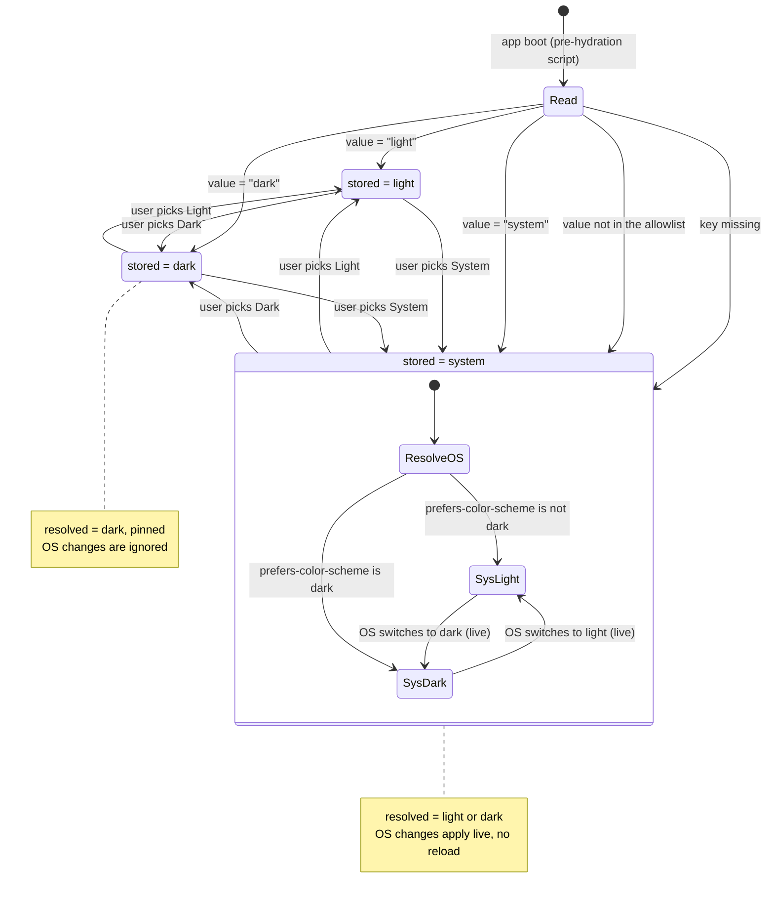

# OnTrack theme contract

**Ticket:** THM-D02 · **Status:** Draft, awaiting approval · **Applies to:** `doubtfire-web`

This is the contract every contributor works to before anyone edits styles for Light/Dark/System.
It fixes the theme states, the semantic token names, how the preference is stored, the
accessibility floor, and what the implementation tickets must prove. It does not implement
anything.

Read sections 4, 6, 7 and 10 before writing any style code. The rest is why.

---

## 1. Missing inputs, and what is provisional because of them

THM-D02 was scheduled after two tickets that have not started.

| Ticket  | Owner             | What it was meant to hand over                     | State       |
| ------- | ----------------- | -------------------------------------------------- | ----------- |
| THM-D01 | Owen Brian Costin | Theme audit and dark-mode blueprint                | Not started |
| MG-05   | Unassigned        | CSS style guide (naming, layering, file ownership) | Not started |

So the audit in section 2 was done from scratch against the working tree at
`origin/11.0.x`. Every number in it comes from a command that is printed next to it, and every
statement about how OnTrack styles itself today comes from a file that was opened.

Three things stay provisional until those two tickets land.

| Provisional                                                                                         | Why                                                                                                     | Who settles it                                     |
| --------------------------------------------------------------------------------------------------- | ------------------------------------------------------------------------------------------------------- | -------------------------------------------------- |
| The token **naming prefix** `--ot-*` and the `--ot-color-* / --ot-status-* / --ot-chart-*` grouping | MG-05 owns naming. `--ot-` was chosen because it collides with nothing in the tree today (section 2.6). | MG-05                                              |
| The **file layout** in section 10 (`src/styles/tokens/_light.scss`, `_dark.scss`)                   | MG-05 owns which layer may declare a colour.                                                            | MG-05                                              |
| The **per-page migration order** for THM-M01 to THM-M04                                             | THM-D01's audit was meant to rank pages by risk. Section 2.5 lists the hard surfaces but not an order.  | THM-D01, and THM-M05 for the FlexLayout sequencing |

Everything else here — states, storage, tokens, values, accessibility floor, test list — is
proposed as final and is not waiting on either ticket.

---

## 2. Audit of the current stylesheet, done for this ticket

Commands were run from the repo root on branch `docs/theme-contract`, rebased onto `origin/11.0.x`
at **`4034e7d1a`** (27 Aug 2026, the closure merge of PR #105). Every count below was re-taken on
that commit. Appendix B has the full list with each command beside its result, and the note there
on which nine numbers moved when the closure branch landed.

### 2.1 Versions

`package.json`: Angular `^22.0.3`, Angular Material `^22.0.2`, Tailwind via
`@tailwindcss/postcss ^4.3.2`, tests on `vitest ^4.1.9` through the
`@angular/build:unit-test` builder. Node `>=22.22.3`.

The Thoth Tech handover says Angular 17 and Karma. Both are stale. Do not plan against them.

### 2.2 How Material is themed today

`angular.json` loads two global stylesheets, in this order: `src/theme.scss`, then
`src/styles.scss`.

`src/theme.scss` builds a **Material 2** theme. It defines three palettes by hand
(`$md-formatif` from `#3939ff`, an accent, a warn), calls `mat.m2-define-light-theme(...)`, then
`@include mat.all-component-themes($theme)`. There is one theme and it is light. The file defines
no dark theme at all — line 162 only reads `is-dark` back off the light config — and there is no
`.dark-theme` class anywhere in the tree. The repo's only `$dark-theme` is at
`src/styles/m3-theme.scss:158`, in the file nothing imports.

`src/styles/m3-theme.scss` **already exists**, is 177 lines, and is generated
(`// This file was generated by running 'ng generate @angular/material:m3-theme'`). It defines
**both** `$light-theme` and `$dark-theme` with `theme-type: light` / `theme-type: dark`,
`use-system-variables: true` and `system-variables-prefix: sys`.

It is not used. `src/styles.scss` lines 24-25 have it commented out:

```scss
// This is the new Angular Material 3 theme file which we will migrate to
// @use './styles/m3-theme.scss';
```

```
$ grep -rIn -- "--sys-" src/ | wc -l
0
```

Nothing consumes it. Turning that comment into code is **not** the plan — see section 3.

`mat.app-background()` and `mat.elevation-classes()` are each included twice, once in
`theme.scss` and again in `styles.scss`. Harmless duplication today, worth a cleanup ticket, not
this one.

### 2.3 The colours the app actually paints

Because the M2 light theme is what runs, the base surfaces come from Material's own light
palettes at `node_modules/@angular/material/core/m2/_palette.scss`:

| Role           | M2 source                                              | Value                 |
| -------------- | ------------------------------------------------------ | --------------------- |
| page           | `$light-theme-background-palette.background` = grey 50 | `#fafafa`             |
| card, dialog   | `.card` / `.dialog`                                    | `#ffffff`             |
| app bar        | grey 100                                               | `#f5f5f5`             |
| body text      | `rgba(black, 0.87)`                                    | flattens to `#212121` |
| secondary text | `rgba(black, 0.54)`                                    | flattens to `#757575` |
| disabled text  | `rgba(black, 0.38)`                                    | flattens to `#9e9e9e` |
| dividers       | `rgba(black, 0.12)`                                    | flattens to `#e0e0e0` |

Those four flattened values land exactly on M2 grey 900 / 600 / 500 / 300. That is not a
coincidence, it is how the palette was built, and it is why the light column in section 7 is a
derivation and not an invention.

The four **text and divider** rows are reproducible without Material installed: they are the
alpha values above composited over white, and `flatten()` in Appendix A returns `#212121`,
`#757575`, `#9e9e9e` and `#e0e0e0` exactly. The three **surface** rows (`#fafafa`, `#ffffff`,
`#f5f5f5`) are read from the M2 palette, and `node_modules` is not installed in this worktree, so
they are quoted from the package rather than re-checked here. They are the stock M2 grey 50 /
white / grey 100 and nothing in the repo overrides them, but treat the file path as a pointer
rather than a citation until someone re-runs it with dependencies installed.

### 2.4 Hard-coded colour, measured

```
$ grep -rIoE '#[0-9a-fA-F]{3,8}\b' src --include='*.scss' | wc -l
471
$ grep -rIlE 'rgba?\(|hsla?\(' src --include='*.scss' | wc -l
25
$ find src -name '*.scss' | wc -l
189
$ grep -rIoh '!important' src --include='*.scss' | wc -l
63
```

238 of the 471 hex literals are in three files that are palettes by design
(`m3-theme.scss` 107, `theme.scss` 84, `task-status-colors.scss` 47). Of the rest, **226 are
scattered across component SCSS under `src/app`**, 6 sit in other shared partials and 1 is in
`styles.scss`.

```
$ grep -rIoE '#[0-9a-fA-F]{3,8}\b' src/app --include='*.scss' | wc -l
226
$ grep -rIlE '#[0-9a-fA-F]{3,8}|rgba?\(|hsla?\(' src/app --include='*.scss' | wc -l
44
$ grep -rIlE 'color|background|border|fill|stroke' src/app --include='*.scss' | wc -l
57
$ find src/app -name '*.scss' | wc -l
178
```

So **57 of the 178 component stylesheets under `src/app` declare a colour, a border or a fill**,
against 44 that hold a hex or an `rgba()`. The wider grep is the honest one for sizing a
migration: it also catches `stroke: white`, `border-radius: $border-radius-base` and a
`task-status-color($status)` call, none of which contain a literal but all of which a theme has
to account for. 57 is the number to burn down, 226 is the number of literals inside it.

The three palette files have not moved (107 / 84 / 47, unchanged), so the whole of the growth is
in component stylesheets: the loose literal count more than doubled from 105 to 226 in a single
closure merge. Two files new to this base carry 94 of the 226 between them,
`ppi-widget.component.scss` with 50 and `demo-controls.component.scss` with 44. That is the rate
this contract exists to stop, and it is the strongest argument for landing the section 10 lint
gate early rather than after the migration — every week it is not in place, the burn-down grows
faster than a migration ticket can shrink it.

Templates carry colour too, as Tailwind arbitrary values:

```
$ grep -rIhoE '\b(text|bg|border)-\[#[0-9a-fA-F]{3,8}\]' src --include='*.html' --include='*.ts' \
    | sort | uniq -c | sort -rn
   5 text-[#c5c5c5]    3 bg-[#da532c]     2 text-[#969696]   2 bg-[#e7e7ff]
   1 text-[#fab143]    1 text-[#da532c]   1 text-[#9696969d] 1 text-[#2c2c2c]
   1 bg-[#fab143]      1 bg-[#43a047]     1 bg-[#333]        1 bg-[#126352]
```

Nine files. That is the whole of the "someone will invent a new grey" risk, made concrete.

### 2.5 Status, urgency and the hard surfaces

**Task status colour has two sources of truth.**
`src/styles/common/task-status-colors.scss` holds a Sass map of 15 statuses with `base`, `dark`,
`light` and `fore`. `src/app/api/models/task-status.ts` holds `STATUS_COLORS`, a second map of
the same 15 hex values in TypeScript. Each file carries a comment telling you to keep it in step
with the other, and the TS one still points at `task-status-colors.less`, a file that no longer
exists. The two maps **do agree today** — all 15 pairs match, checked value by value. They agree
by hand, not by construction.

**Due-date urgency is inline in one template.**
`src/app/units/task-viewer/directives/unit-task-list/unit-task-list.component.html:264-267`:

```html
[ngClass]="{ 'text-[#da532c]': task.daysUntilDueDate() <= 0, 'font-normal text-[#fab143]':
task.daysUntilDueDate() > 0 && task.daysUntilDueDate() < 11, 'font-normal text-gray-500':
task.daysUntilDueDate() > 11, }"
```

Three urgency bands, no named token, one of them a Tailwind default grey.

**Surfaces THM-M04 will fight**, all confirmed present in `package.json` and in use:

| Surface         | Library                                                                     | Why it is hard                                                                                                |
| --------------- | --------------------------------------------------------------------------- | ------------------------------------------------------------------------------------------------------------- |
| Code editors    | `monaco-editor`, `ngx-monaco-editor-v2-alternative`, `@ngstack/code-editor` | Monaco takes a theme **name**, not CSS. Seven call sites pin `theme: 'vs'` or `'vs-dark'` literally.          |
| Charts          | `@swimlane/ngx-charts`, `d3`                                                | Colour arrives as a JS `domain` array, not CSS. Two hard-coded domains found.                                 |
| PDF / portfolio | `ng2-pdf-viewer`                                                            | Renders into a canvas. CSS cannot reach it; a filter inversion is the only lever.                             |
| Calendar        | `angular-calendar` (CSS imported raw in `styles.scss`)                      | Third-party CSS with its own light palette.                                                                   |
| Gantt           | `@worktile/gantt` (SCSS loaded in `angular.json`)                           | Same.                                                                                                         |
| Terminal output | `ansi-to-html`                                                              | Emits inline `style="color:#..."` from ANSI codes.                                                            |
| Emoji picker    | `@ctrl/ngx-emoji-mart` (`picker.css`)                                       | Ships a `darkMode` input; `task-comment-composer.component.html:5` currently hard-codes `[darkMode]="false"`. |

The two chart palettes, verbatim:

```ts
// visualisations/progress-burndown-chart/progress-burndown-chart.component.ts:70-76
private readonly seriesPalette: string[] = [
  '#AAAAAA', '#777777', '#0079d8', '#E01B5D', '#7C3AED',
];
// ...fed to the scheme at :81 as domain: [...this.seriesPalette]
//    and per-series at :360 via seriesColor(index)

// common/project-progress/project-progress-gauge.component.ts:41
domain: ['#5AA454', '#E44D25', '#CFC0BB', '#7aa3e5', '#a8385d', '#aae3f5'],
```

The burndown palette moved during the closure merge: it was an inline `domain` array and is now a
named constant, and its fifth slot changed from `'transparent'` to a real fifth colour `#7C3AED`.
That is one more series colour for THM-M04 to map onto `--ot-chart-*`, and section 8.2 allocates
six slots, so it fits. The refactor is also the better shape to migrate — one constant to
re-point instead of two call sites.

### 2.6 What does not exist yet

```
$ grep -rIn "prefers-color-scheme" src/ | wc -l
0
$ grep -rIn "color-scheme" src/ | wc -l
0
$ grep -rIn "@media print" src/ | wc -l
0
$ grep -rIn "prefers-reduced-motion" src/ | wc -l
2
```

The two `prefers-reduced-motion` blocks are new and both are component-local
(`demo-controls.component.scss:497`, `ppi-widget.component.scss:503`). There is still no
app-wide reduced-motion rule, so section 12 sets one rather than assuming it is covered.

No dark preference is stored anywhere. `src/index.html` sets a fixed
`<meta content="#3939ff" name="theme-color" />` and `src/manifest.webmanifest` sets
`"theme_color": "#3939ff"`, `"background_color": "#ffffff"`. `<body class="mat-typography">` is
the only body class.

CSS custom properties are barely used, which is why the token namespace is free:

```
$ grep -rIhoE '^\s*--[a-z0-9-]+\s*:' src --include='*.scss' | tr -d ' ' | sort | uniq -c
   3 --background-gray:   2 --mat-chip-disabled-label-text-color:
   1 --status-chip-bg:    1 --mat-tab-container-height:
   1 --mat-progress-bar-track-height:   1 --mat-progress-bar-active-indicator-height:
   1 --mat-badge-text-color:   1 --mat-badge-container-overlap-offset:
   1 --mat-badge-container-offset:
```

Nine names, twelve declarations, and six of the nine are Material's own `--mat-*` overrides
rather than anything of ours. The `--ot-` prefix still collides with nothing.

Focus handling is a live risk, and the headline counts understate it. There are 11
`outline: none` / `outline: 0` declarations and 11 `:focus-visible` rules, which reads as level
where it used to read 11-against-7. It is not level. The two sets barely overlap:

```
$ comm -12 <(grep -rIlE "outline:\s*(none|0)" src --include='*.scss' | sort) \
           <(grep -rIl "focus-visible" src --include='*.scss' | sort)
src/app/common/file-uploader/file-uploader.component.scss
```

Ten files suppress an outline and seven declare a `:focus-visible` rule, but only **one file does
both** — `file-uploader.component.scss`. The four `:focus-visible` rules added by the closure
merge landed in four files that suppress no outline at all, three of which
(`notifications-page`, `demo-controls`, `ppi-widget`) did not exist on the previous base. So the
gap did not close: **nine of the ten outline-suppressing files still have no replacement ring**,
exactly as before. This is why section 12 makes auditing all 11 suppressions a named item in
THM-F01 rather than treating the ratio as evidence of anything.

### 2.7 The accessibility problem that already ships

Status chips pair a `base` fill with a `fore` foreground of `#fff` or `#444`. Measured (method
and script in Appendix A):

| Status                                | Fill      | Foreground | Ratio | AA 4.5:1 |
| ------------------------------------- | --------- | ---------- | ----- | -------- |
| working-on-it                         | `#eb8f06` | `#ffffff`  | 2.48  | **fail** |
| complete                              | `#5bb75b` | `#ffffff`  | 2.51  | **fail** |
| discuss                               | `#31b0d5` | `#ffffff`  | 2.53  | **fail** |
| attention-required                    | `#f1814d` | `#ffffff`  | 2.63  | **fail** |
| need-help                             | `#a48fce` | `#ffffff`  | 2.84  | **fail** |
| feedback-exceeded                     | `#d46b54` | `#ffffff`  | 3.48  | **fail** |
| demonstrate                           | `#428bca` | `#ffffff`  | 3.63  | **fail** |
| ready-for-feedback                    | `#0079d8` | `#ffffff`  | 4.44  | **fail** |
| fail, time-exceeded                   | `#d93713` | `#ffffff`  | 4.66  | pass     |
| not-started                           | `#cccccc` | `#444444`  | 6.06  | pass     |
| fix-and-resubmit, assess-in-portfolio | `#f2d85c` | `#444444`  | 6.84  | pass     |
| rediscuss                             | `#126352` | `#ffffff`  | 7.16  | pass     |
| redo                                  | `#804000` | `#ffffff`  | 7.92  | pass     |

Eight of thirteen distinct pairs fail AA today, in light mode, before dark mode exists. The
secondary text colour has the same problem: `#757575` on a `#ffffff` card is 4.61 and passes, but
on the `#fafafa` page it is **4.41** and fails.

This is why section 7 does not simply copy the current values forward.

---

## 3. Material theming approach

**Decision: a staged bridge. Keep the M2 theme rendering the components, add an independent
semantic token layer on top now, and move Material onto tokens per component group later.**

### The three options

| Option                                                           | What it means                                                                             | Verdict                                                                                                                                                       |
| ---------------------------------------------------------------- | ----------------------------------------------------------------------------------------- | ------------------------------------------------------------------------------------------------------------------------------------------------------------- |
| A. Stay on M2, add a second `m2-define-dark-theme` under a class | One extra `@include mat.all-component-colors($dark)` in a `.dark` block                   | Rejected. Roughly doubles emitted CSS, gives no token vocabulary for the 233 loose hexes outside the three palette files, and locks us further into an API Angular is winding down. |
| B. Uncomment `m3-theme.scss` and switch wholesale                | Swap M2 for the generated M3 light and dark themes                                        | Rejected. See below.                                                                                                                                          |
| **C. Staged bridge**                                             | Ship `--ot-*` tokens and the state machine first; migrate Material component groups after | **Chosen.**                                                                                                                                                   |

### Why B is rejected

`m3-theme.scss` was generated from `#3939FF` and never wired up. Switching to it in one commit
would, in a single PR: change every Material component's density, shape and typography scale at
once; re-map the `warn` palette (M2 `#ef4444`) onto the M3 `error` ramp (`#ba1a1a`); and leave
the 226 component-level hex literals and the 15 status colours untouched and now clashing with a
new set of greys. The failure mode is exactly the one this ticket exists to prevent: several
people fixing different dark greys in parallel.

It is also not a small change. `m3-theme.scss:138` and `:158` both call `mat.define-theme`, which
is the older M3 entry point, and the file was generated against it (`m3-theme.scss:1`). Angular
Material has since added `mat.theme()`, which takes a `theme-type` of `color-scheme` and emits
both themes from one include. If we are going to move Material, that is the target, not the
generated file as written — and either way it is a separately sized ticket, not a comment
uncomment.

> **Not verified here.** `node_modules` is not installed in this worktree, so the `mat.theme()`
> behaviour above is stated from the Material 22 public API and **has not been checked against
> the installed package**. An earlier draft pinned it to
> `node_modules/@angular/material/core/tokens/_system.scss:57-82` and `:253`; those line numbers
> are removed because nothing in this repo can confirm them and a citation nobody can check is
> worth less than none. The rejection of option B does not rest on this paragraph — it rests on
> the blast radius in the paragraph above it, which is verifiable in-tree. Whoever picks up the
> Material migration ticket should confirm the API against the installed version before quoting
> it.

### What C means concretely

1. **Now (THM-F01).** `src/theme.scss` is untouched. A new token layer declares `--ot-*` on the
   root element for both themes. Nothing Material renders changes.
2. **Now.** New and migrated code reads `--ot-*` only. The 226 loose literals get replaced page
   by page (THM-M01 to M04) with no visual change in light mode.
3. **Later, per component group.** Material components are pulled onto the tokens with
   `mat.theme-overrides()` or `--mat-*` system variables, one group per PR (buttons, then form
   fields, then tables, and so on). Each PR is independently reviewable and revertible.
4. **Later still.** When every group is covered, `theme.scss` shrinks to typography and the M2
   colour include is deleted.

### Compatibility

- `--ot-*` custom properties inherit and cascade. They cannot break an M2 rule that does not
  reference them, so step 1 is inert by construction.
- `light-dark()` is **not** used in the token layer. Values are written literally under the DOM
  marker so the resolved theme is legible in DevTools and does not depend on the browser's
  `color-scheme` computation. The `color-scheme` CSS property is still set (section 11) so
  scrollbars and form controls follow.
- Tailwind's `important: true` in `tailwind.config.js` means every utility already outranks
  Material component CSS. Reading a token through a utility keeps that behaviour, it does not
  change it.

### Rollback

| Stage failing        | Rollback                                                                                                 | Blast radius                                        |
| -------------------- | -------------------------------------------------------------------------------------------------------- | --------------------------------------------------- |
| Token layer          | Remove the `@use` of the token file. Every `var(--ot-x, <fallback>)` falls back to its literal.          | None, if the fallback rule in section 10 is obeyed. |
| Toggle / persistence | Feature-flag the toggle off. The DOM marker is then never set, and the `:root` block is the light theme. | None. Light mode is the unmarked default by design. |
| One component group  | Revert that one PR.                                                                                      | That group only.                                    |
| A migrated page      | Revert that one PR.                                                                                      | That page only.                                     |

**Every `var()` in the token layer's consumers must carry a literal fallback matching today's
light value.** That single rule is what makes rollback free, and it is a review gate.

---

## 4. Theme states

Two vocabularies. They are not the same set and they are never stored in the same place.

|                       | Values                    | Where it lives                   | Who writes it            |
| --------------------- | ------------------------- | -------------------------------- | ------------------------ |
| **Stored preference** | `light`, `dark`, `system` | `localStorage`, key in section 6 | The user, via the toggle |
| **Resolved theme**    | `light`, `dark`           | In memory, and on the DOM marker | `ThemeService` only      |

The stored preference is the same three values wherever it is kept. THM-B01 adds a second store
for it on the user account (section 6.2); it does not add a fourth value, a fourth state or a
new resolution rule, so everything below survives phase two unchanged.

`system` is never a resolved value. It is an instruction meaning _follow
`prefers-color-scheme`_. Anything that needs to know what is on screen reads the resolved
theme. Anything that renders the toggle reads the stored preference, so the toggle can show
three options and highlight `system`.

Resolution is one line:

```
resolved = stored === 'system' ? (matchMedia('(prefers-color-scheme: dark)').matches ? 'dark' : 'light')
                               : stored
```

### State diagram



Three rules fall out of the diagram and are testable:

1. An unreadable, missing or invalid stored value resolves to `system`. Never to a hard `dark`.
2. While stored is `light` or `dark`, OS changes are ignored. The user's explicit choice wins.
3. Changing the OS preference while stored is `system` repaints without a reload.

---

## 5. DOM marker

**One attribute, on `<html>`, carrying the resolved theme only:**

```html
<html lang="en" data-ot-theme="dark"></html>
```

- Name: `data-ot-theme`. Values: exactly `light` or `dark`. Nothing else is ever written.
- It goes on `document.documentElement`, not `<body>`. `<body class="mat-typography">` is
  already load-bearing and the pre-hydration script (section 11) runs in `<head>`, before
  `<body>` exists.
- **In light mode the attribute is present and set to `light`.** It is not omitted. A selector
  should never have to mean "absence of dark".
- A data attribute, not a class, because `<html>` classes are a shared namespace that Angular,
  Material and Tailwind all write into, and a stray `.dark` is easy to add by accident. An
  attribute with a fixed two-value domain is not.
- Selector form for the token layer, and the only two blocks that may declare a colour value:

```scss
:root,
:root[data-ot-theme='light'] {
  /* light values */
}

:root[data-ot-theme='dark'] {
  /* dark values */
}
```

The bare `:root` first means the app is correct in light mode even if the script never runs.

---

## 6. Storage

| Field               | Value                                                                        |
| ------------------- | ---------------------------------------------------------------------------- |
| Key                 | `ontrack.theme.preference`                                                   |
| Allowed values      | `light`, `dark`, `system` — exactly these three lowercase ASCII strings      |
| Default when absent | `system`                                                                     |
| Format              | A bare string. **Not** JSON, not an object, not a serialised class           |
| Scope               | `localStorage`, per browser profile and origin. Section 6.2 adds the account |

The key follows the convention already in the tree, which now has two independent uses of it:

```
src/app/units/task-viewer/directives/unit-task-list/unit-task-list.component.ts:586
  `ontrack.unitTaskList.${unitId}.viewPreferences`
src/app/projects/states/plan/task-planner/task-planner.component.ts:82
  `ontrack.taskPlanner.${projectId}.showTasksAboveTargetGrade`
```

Namespace, dot separators, camelCase leaf. `ontrack.theme.preference` is the same shape with no
id segment, because the preference is per browser profile rather than per unit or per project.

### 6.1 Validation, and the rule that matters

```ts
export type ThemePreference = 'light' | 'dark' | 'system';
const THEME_PREFERENCES: readonly ThemePreference[] = ['light', 'dark', 'system'] as const;
const THEME_STORAGE_KEY = 'ontrack.theme.preference';

function isThemePreference(v: unknown): v is ThemePreference {
  return typeof v === 'string' && (THEME_PREFERENCES as readonly string[]).includes(v);
}

function readThemePreference(): ThemePreference {
  try {
    const raw = localStorage.getItem(THEME_STORAGE_KEY);
    return isThemePreference(raw) ? raw : 'system';
  } catch {
    return 'system'; // private mode, blocked storage, quota
  }
}
```

**The stored string is never evaluated as CSS or as code.** It is compared against a fixed
allowlist and then used only to pick one of two literal attribute values. It is never
interpolated into a stylesheet, a `style` attribute, a class name, a selector, an
`innerHTML`, a `Function`, or an `eval`. There is no path from `localStorage` to the CSSOM.

Any value not in the allowlist — a typo, a stale value from an older build, a string another
tab wrote, a value a user typed into DevTools — falls back to `system` **and is not rewritten**.
Silently overwriting it would hide the fact that something is writing junk to that key.

The same allowlist governs the write side. `setPreference` takes `ThemePreference`, so an
invalid value cannot be stored through the service at all.

### 6.2 Cross-device persistence — THM-B01, phase two

`localStorage` is per browser profile. Sign in on a laptop and on a lab machine and you set the
preference twice. **THM-B01 closes that**, and this section is the contract it builds to, so the
card can be specified now and landed after THM-F01 without reopening anything here.

The client-only store is not "local forever". It is phase one of two.

| Phase            | Store                                    | Ticket  |
| ---------------- | ---------------------------------------- | ------- |
| One, ships first | `localStorage` only                      | THM-F01 |
| Two, adds to it  | `localStorage` **plus** the user account | THM-B01 |

Phase two **adds** a store. It does not replace one, and it changes nothing in section 4,
section 5 or the startup script. Five rules hold the two stores together.

**1. Local is always the boot store.** The script in section 11 runs before the app has a
session, so `localStorage` is the only thing it can read. The account value is not reachable at
first paint and must never be waited on, or the no-flash guarantee is gone. Phase two therefore
does not touch startup at all.

**2. The account stores the preference, never the resolved theme.** A user who picked `system`
has `system` on their account. It never becomes `dark` because their operating system was dark
when they last signed in. Same three values, same allowlist as 6.1, validated again server-side.
This is the rule that keeps section 15's objection answered: the account never learns the user's
OS appearance.

**3. Conflict is settled by last write, not by store.** Neither side outranks the other.

- The device writes `ontrack.theme.preference.updatedAt`, an ISO 8601 string, beside the
  preference. A **second** key on purpose, so the key section 11 reads stays a bare allowlisted
  enum and the boot script never parses a date.
- The API carries the equivalent beside its field.
- Newer wins. On a tie the account value wins, so two devices cannot ping-pong.
- The winner is written to **both** sides in the same pass, so one round trip converges them.

**Presence beats recency, and timestamps are only consulted when both sides hold a value.** This
is the rule that decides the migration, so it is written as a table rather than as prose. Read
"has a preference" as "holds one of the three allowlisted strings"; anything else is treated as
absent, per 6.1.

| Local preference | Account preference | Outcome                                                                        |
| ---------------- | ------------------ | ------------------------------------------------------------------------------ |
| absent           | absent             | Nothing is stored on either side. Follow `system`. Write nothing anywhere.     |
| absent           | present            | Adopt the account value and write it locally. Rule 4.                          |
| **present**      | **absent**         | **Keep the local value, upload it, and stamp `updatedAt` at the moment of the upload.** |
| present          | present            | Compare timestamps. Newer wins, tie goes to the account.                        |

Only the fourth row consults a timestamp. So "a local timestamp that is missing, unparseable or
in the future counts as older, and the account value is taken" applies **inside that row only**,
where the account demonstrably holds a real choice. It must never be read as licence to discard a
local preference against an empty account field.

**Why the third row matters more than it looks.** It is not an edge case, it is day one of
THM-B01 for the entire existing user base. Phase one writes only
`ontrack.theme.preference`; the `updatedAt` key does not exist until phase two introduces it. So
on the morning THM-B01 ships, every user who ever touched the toggle has a valid local
preference, **no** local timestamp, and an empty account field. Under a naive reading of the
timestamp clause — missing timestamp counts as older, so take the account — every one of them
would silently have their theme reset to `system` by a backend migration they did not ask for.
Presence beating recency is what prevents that, and it is why the ordering is fixed here rather
than left to THM-B01.

Two consequences that follow from the third row and are intended:

- **The upload stamps `now`, and does not backdate.** The device cannot know when the preference
  was originally chosen, and inventing a plausible earlier timestamp would be fabricating the
  input to a conflict resolution. `now` is the honest value.
- **If the same user migrates on two devices, the later sign-in wins.** Device A signs in, finds
  an empty account, and uploads `dark` stamped `T1`. Device B signs in at `T2` holding `light`
  with no timestamp; the account now has a value, so row four applies, B's missing timestamp
  counts as older, and B adopts `dark`. Deterministic, converges in one pass, no ping-pong. It
  does mean one device's pre-migration choice is dropped, which is the price of having no
  timestamp to compare, and THM-Q01 should confirm it looks like a single repaint rather than a
  fight.

**4. A device that has never set a preference adopts the account value.** Nothing valid in
`localStorage` means nothing to compare, so the account value is adopted, written locally, and
the next boot on that device is flash-free. Until the response lands, that first session follows
`system`. One repaint, on the first session on a new device, is the accepted cost of rule 1. It
is stated behaviour, not a defect for THM-Q01 to raise. Where the account is *also* empty, row
one of the table applies and nothing is written at all — a brand-new user is not given a stored
preference they never chose.

**5. The sync never blocks and never fails loudly.** A 4xx, a 5xx, an offline device, or a
request still in flight, all leave the local value applied and in charge. The retry is the next
boot. A theme preference is not worth a spinner, a toast or an error state.

Two further constraints, both review gates.

- **Sign-out does not clear the key.** It is presentation state, not session state. The next
  person on a shared machine sees the previous theme until their own preference arrives, then it
  repaints. Clearing it would reintroduce a flash for the common single-user case to fix the rare
  shared-machine one.
- **Writes are debounced and only fire on a real change.** Cycling the toggle three times sends
  one request.

What THM-B01 owns and this document does not decide: the field name, whether it hangs off the
user record or a separate preferences table, and the endpoint shape. Those are `doubtfire-api`
decisions made with that repo's reviewers. The three values, the allowlist, last-write-wins, and
"preference not resolved theme" are fixed here and are not THM-B01's to change.

---

## 7. Semantic tokens

Every one of these is a **role**, not a place. There is no `--ot-dashboard-bg`. If a page needs
a colour that is not here, that is a conversation in the theme thread, not a new hex in a
component stylesheet.

**Derivation.** The light column is the M2 light theme the app renders today (section 2.3),
flattened where Material used alpha, and darkened in 0.5% HSL lightness steps only where the
current value misses 4.5:1 against the **page** background `#fafafa`, which is the worst case.
The dark column is taken from the neutral and primary ramps in the already-checked-in
`src/styles/m3-theme.scss`, so the dark greys are not invented either, then lifted the same way
where needed. Ratios were computed, not estimated. Appendix A has the script.

| Token                        | Role                                                      | Light     | Dark      | Worst-case ratio      |
| ---------------------------- | --------------------------------------------------------- | --------- | --------- | --------------------- |
| `--ot-color-page`            | Page background behind everything                         | `#fafafa` | `#131316` | —                     |
| `--ot-color-surface`         | Cards, dialogs, table bodies, panels                      | `#ffffff` | `#201f23` | —                     |
| `--ot-color-surface-raised`  | Menus, popovers, sticky headers, anything above a surface | `#ffffff` | `#2a292d` | —                     |
| `--ot-color-text`            | Body and heading text                                     | `#212121` | `#e5e1e6` | 11.18 on dark raised  |
| `--ot-color-text-muted`      | Secondary text, captions, hints                           | `#616161` | `#adaaaf` | 5.93 on light page    |
| `--ot-color-border`          | Control boundaries: inputs, outlined buttons, chips       | `#8a8a8a` | `#78767a` | 3.21 on dark raised   |
| `--ot-color-divider`         | Decorative rules between rows and sections                | `#e0e0e0` | `#353438` | n/a, decorative       |
| `--ot-color-focus`           | Focus ring                                                | `#3939ff` | `#c0c1ff` | 6.28 light, 8.47 dark |
| `--ot-color-link`            | Inline links                                              | `#3939ff` | `#c0c1ff` | 6.28 on light page    |
| `--ot-color-primary`         | Primary actions, active nav, brand accents                | `#3939ff` | `#c0c1ff` | 6.28 on light page    |
| `--ot-color-on-primary`      | Text and icons on a primary fill                          | `#ffffff` | `#131316` | 6.56 / 10.87          |
| `--ot-color-success`         | Success text and icons                                    | `#398239` | `#5bb75b` | 4.55 on light page    |
| `--ot-color-warning`         | Warning text and icons                                    | `#a56504` | `#eb8f06` | 4.51 on light page    |
| `--ot-color-error`           | Error text, invalid fields, destructive actions           | `#d73613` | `#ef6445` | 4.53 on dark raised   |
| `--ot-color-info`            | Informational text and icons                              | `#0075d0` | `#0792ff` | 4.52 on light page    |
| `--ot-color-inverse-surface` | Snackbars, tooltips, anything inverted                    | `#212121` | `#e5e1e6` | —                     |
| `--ot-color-inverse-text`    | Text on an inverse surface                                | `#fafafa` | `#201f23` | 15.43 / 12.67         |

Three notes that are part of the contract, not commentary.

- **`--ot-color-surface` and `--ot-color-surface-raised` are the same value in light** (`#ffffff`).
  In light mode a raised surface is separated by `--ot-elevation-1`, not by hue. In dark mode it
  is separated by hue, because shadows do not read on a dark ground. **Never rely on the
  raised-versus-surface difference alone to communicate anything.**
- **`--ot-color-border` and `--ot-color-divider` are different tokens on purpose.** WCAG 1.4.11
  requires 3:1 for boundaries that carry meaning, such as the edge of a text input. It does not
  apply to a decorative rule between two table rows. `--ot-color-border` clears 3:1 in both
  themes. `--ot-color-divider` does not, and must never be used as a control boundary.
- **`--ot-color-text-muted` in light is `#616161`, not the `#757575` the app uses today**, because
  `#757575` measures 4.41 against `--ot-color-page`. This is a real fix, not a restyle.

---

## 8. Domain tokens

### 8.1 Task status

Fifteen statuses. The method, applied in order: keep the shipped fill if white text on it already
clears 4.5:1; otherwise keep the shipped fill and use `--ot-color-text` (`#212121`) if that
clears 4.5:1; only if neither works, darken the fill in 0.5% HSL lightness steps, hue and
saturation held, until white text reaches 4.5:1. **Thirteen of fifteen fills come through
unchanged.** The dark fill is a container: same hue, same saturation, lightness pinned to 22%.
The dark on-fill is the same hue lifted until it clears 4.5:1 on that container.

| Status                | Shipped fill | `--ot-status-*` light | `-on` light | Ratio | `--ot-status-*` dark | `-on` dark | Ratio |
| --------------------- | ------------ | --------------------- | ----------- | ----- | -------------------- | ---------- | ----- |
| `ready-for-feedback`  | `#0079d8`    | `#0078d5`             | `#ffffff`   | 4.52  | `#003f70`            | `#47aeff`  | 4.51  |
| `not-started`         | `#cccccc`    | `#cccccc`             | `#212121`   | 10.03 | `#383838`            | `#a1a1a1`  | 4.54  |
| `working-on-it`       | `#eb8f06`    | `#eb8f06`             | `#212121`   | 6.49  | `#6d4303`            | `#fab042`  | 4.63  |
| `need-help`           | `#a48fce`    | `#a48fce`             | `#212121`   | 5.67  | `#31224e`            | `#9d86ca`  | 4.56  |
| `fix-and-resubmit`    | `#f2d85c`    | `#f2d85c`             | `#212121`   | 11.31 | `#685708`            | `#f1d44c`  | 4.83  |
| `feedback-exceeded`   | `#d46b54`    | `#d46b54`             | `#212121`   | 4.62  | `#5a2317`            | `#dc8572`  | 4.53  |
| `redo`                | `#804000`    | `#804000`             | `#ffffff`   | 7.92  | `#703800`            | `#ff9e3d`  | 4.53  |
| `discuss`             | `#31b0d5`    | `#31b0d5`             | `#212121`   | 6.37  | `#134c5d`            | `#5ec1de`  | 4.58  |
| `rediscuss`           | `#126352`    | `#126352`             | `#ffffff`   | 7.16  | `#115f4f`            | `#5be1c5`  | 4.69  |
| `demonstrate`         | `#428bca`    | `#337ab7`             | `#ffffff`   | 4.56  | `#193a58`            | `#6ea6d6`  | 4.53  |
| `complete`            | `#5bb75b`    | `#5bb75b`             | `#212121`   | 6.42  | `#224e22`            | `#78c478`  | 4.57  |
| `fail`                | `#d93713`    | `#d93713`             | `#ffffff`   | 4.66  | `#671a09`            | `#f17c62`  | 4.51  |
| `time-exceeded`       | `#d93713`    | `#d93713`             | `#ffffff`   | 4.66  | `#671a09`            | `#f17c62`  | 4.51  |
| `assess-in-portfolio` | `#f2d85c`    | `#f2d85c`             | `#212121`   | 11.31 | `#685708`            | `#f1d44c`  | 4.83  |
| `attention-required`  | `#f1814d`    | `#f1814d`             | `#212121`   | 6.12  | `#682708`            | `#f28a5a`  | 4.55  |

Token names are `--ot-status-<key>` and `--ot-status-<key>-on`, where `<key>` is the existing
kebab-case class from `TaskStatus.statusClass()`.

Only two light fills move: `ready-for-feedback` (`#0079d8` → `#0078d5`) and `demonstrate`
(`#428bca` → `#337ab7`). Six flip their foreground from `#ffffff` to `--ot-color-text` with the
fill untouched — `working-on-it`, `need-help`, `feedback-exceeded`, `discuss`, `complete`,
`attention-required`. Three keep their fill and move their foreground off the shipped `#444444`
onto the same token — `not-started`, `fix-and-resubmit`, `assess-in-portfolio`. That leaves four
untouched in both fill and foreground: `redo`, `rediscuss`, `fail`, `time-exceeded`.

Thirteen of fifteen dark fills are distinct. The two collisions are `fail`/`time-exceeded` and
`fix-and-resubmit`/`assess-in-portfolio`, which already share a base colour today. No **new**
collision is introduced.

**The two-maps problem must be closed during the shared-component migration, not carried
forward.** No card on the board names it in its own words, and both files are shared rather than
per-page — `src/styles/common/task-status-colors.scss` and `src/app/api/models/task-status.ts` —
so it belongs to **THM-M01, shell and shared components**, and THM-JL01 should confirm that when
the card is written up. After migration `STATUS_COLORS` in `task-status.ts` is deleted and any
TypeScript that needs a status colour reads `var(--ot-status-<key>)`. Where a JS value is
unavoidable (charts), it is read once via
`getComputedStyle(document.documentElement).getPropertyValue(...)` and re-read on theme change.
One source of truth, in CSS.

### 8.2 Everything else

| Group     | Token                         | Light                        | Dark                         | Note                                                             |
| --------- | ----------------------------- | ---------------------------- | ---------------------------- | ---------------------------------------------------------------- |
| Urgency   | `--ot-urgency-overdue`        | `#c94823`                    | `#e06f4f`                    | from `#da532c`; 4.54 light page, 4.51 dark raised                |
|           | `--ot-urgency-soon`           | `#a56504`                    | `#fab143`                    | from `#fab143`; 4.51 light page, 7.87 dark raised                |
|           | `--ot-urgency-later`          | `#616161`                    | `#adaaaf`                    | alias of `--ot-color-text-muted`; replaces `text-gray-500`       |
| Charts    | `--ot-chart-1`                | `#3939ff`                    | `#6c6cff`                    | series slots, ≥3:1 vs their own page (1.4.11); worst 3.02 / 4.52 |
|           | `--ot-chart-2`                | `#0079d8`                    | `#007fe2`                    |                                                                  |
|           | `--ot-chart-3`                | `#58a152`                    | `#5aa454`                    |                                                                  |
|           | `--ot-chart-4`                | `#e44d25`                    | `#e44d25`                    |                                                                  |
|           | `--ot-chart-5`                | `#a8385d`                    | `#c7587d`                    |                                                                  |
|           | `--ot-chart-6`                | `#d07e05`                    | `#eb8f06`                    |                                                                  |
|           | `--ot-chart-grid`             | `#e0e0e0`                    | `#353438`                    | gridlines, decorative                                            |
|           | `--ot-chart-axis`             | `#616161`                    | `#adaaaf`                    | axis labels are text, 4.5:1                                      |
| Code      | `--ot-code-surface`           | `#f5f5f5`                    | `#0e0e11`                    | `<pre>`, ANSI output, diff panes                                 |
|           | `--ot-code-text`              | `#212121`                    | `#e5e1e6`                    | 14.77 / 14.91 on their own surface                               |
|           | Monaco theme name             | `vs`                         | `vs-dark`                    | not a CSS var; set in TS from the resolved theme                 |
| Overlays  | `--ot-scrim`                  | `rgba(0, 0, 0, 0.32)`        | `rgba(0, 0, 0, 0.60)`        | dialog and drawer backdrop                                       |
|           | `--ot-elevation-1`            | `0 1px 3px rgba(0,0,0,0.12)` | `0 1px 3px rgba(0,0,0,0.50)` | shadow, not colour                                               |
| Disabled  | `--ot-color-disabled-text`    | `#9e9e9e`                    | `#6f6d72`                    | 1.4.3 exempts inactive controls; still needs a non-colour cue    |
|           | `--ot-color-disabled-surface` | `#eeeeee`                    | `#2a292d`                    |                                                                  |
| Selection | `--ot-color-selected`         | `#e7e7ff`                    | `#2e2e5c`                    | selected row or chip fill                                        |
|           | `--ot-color-selected-text`    | `#212121`                    | `#e5e1e6`                    | 13.24 / 9.78                                                     |
|           | `--ot-color-hover`            | `rgba(0, 0, 0, 0.04)`        | `rgba(255, 255, 255, 0.06)`  | matches the M2 `hover` slot already in use                       |

`--ot-color-selected` light is `#e7e7ff`, which is `formatif-blue-lighter` from
`tailwind.config.js` and `$md-formatif.50` from `theme.scss`. It is already the app's selection
tint, it just had no name.

---

## 9. Fixed brand vs theme-aware

| Fixed in both themes                                                                       | Why                                                                                                                          |
| ------------------------------------------------------------------------------------------ | ---------------------------------------------------------------------------------------------------------------------------- |
| `#3939ff` as the **brand mark** — the logo, the favicon, `icon.svg`, the PWA `theme_color` | Brand identity. A logo that changes colour is a different logo.                                                              |
| The status **identity**, meaning which hue means `complete`                                | Green means complete in both themes. Teaching staff read these chips daily and re-learning them in dark mode is a real cost. |
| `#da532c`, `$doubtfire-color` in `variables.scss`                                          | Legacy brand colour. Keep or retire it, do not theme it.                                                                     |

| Theme-aware                                                 | Why                                                                                                                                |
| ----------------------------------------------------------- | ---------------------------------------------------------------------------------------------------------------------------------- |
| `--ot-color-primary`, `--ot-color-link`, `--ot-color-focus` | `#3939ff` is 6.28:1 on the light page, 2.83:1 on the dark page and 2.20:1 on the worst-case dark raised surface. It misses 4.5:1 for text and 3:1 for a focus ring, so the brand blue cannot be the dark-mode interactive colour. |
| Every status **fill and foreground**                        | The hue stays recognisable; the lightness has to move or the chip is unreadable. Section 8.1.                                      |
| All surfaces, text, borders, dividers, shadows, scrims      | Definitionally.                                                                                                                    |
| Chart series                                                | A series colour is a graphical object under WCAG 1.4.11 and needs 3:1 against its own ground.                                      |
| The `theme-color` meta tag                                  | Section 12.                                                                                                                        |

The distinction in one sentence: **the brand mark is fixed, the brand as an interface colour is
theme-aware.**

---

## 10. Who may declare a colour, and how each layer reads the tokens

Four layers. Exactly one of them is allowed to contain a colour value.

| Layer                                                           | May declare a colour?  | Job                                                                           |
| --------------------------------------------------------------- | ---------------------- | ----------------------------------------------------------------------------- |
| **Token layer** — `src/styles/tokens/_light.scss`, `_dark.scss` | **Yes, and only here** | Declare every `--ot-*` for one theme. Two files, two blocks, no logic.        |
| **Material theme** — `src/theme.scss`                           | Transitional           | M2 palettes stay until section 3 step 4 retires them. No new colour goes in.  |
| **Shared SCSS** — `src/styles/common`, `src/styles/mixins`      | No                     | Mixins and layout. Colour only through `var(--ot-*)`.                         |
| **Component SCSS and templates**                                | No                     | Consume `var(--ot-*)` or a Tailwind utility. A new hex is a review rejection. |

### Tailwind

Tailwind must **map** to the tokens, never restate them. Tailwind 4 is in use with a v3-style
JS config loaded through `@config '../tailwind.config.js'` from `src/styles.scss` and
`src/tailwind-intellisense.css`. Extend the theme with `var()` references:

```js
// tailwind.config.js
theme: {
  extend: {
    colors: {
      'formatif-blue': '#3939ff',                    // brand mark, stays literal
      'formatif-blue-lighter': '#e7e7ff',
      page: 'var(--ot-color-page)',
      surface: 'var(--ot-color-surface)',
      'surface-raised': 'var(--ot-color-surface-raised)',
      content: 'var(--ot-color-text)',
      muted: 'var(--ot-color-text-muted)',
      border: 'var(--ot-color-border)',
      divider: 'var(--ot-color-divider)',
      primary: 'var(--ot-color-primary)',
      link: 'var(--ot-color-link)',
      success: 'var(--ot-color-success)',
      warning: 'var(--ot-color-warning)',
      error: 'var(--ot-color-error)',
      info: 'var(--ot-color-info)',
    },
  },
},
```

`bg-surface text-content border-border` then resolves per theme with **no dark variant on a
colour utility**. Tokens are the default and they stay the default. A `dark:bg-x` on a colour
doubles every class list and moves the palette back into templates, which is the thing this
contract exists to stop.

#### The dark variant is configured and pointed at the marker — THM-F03

`darkMode` is not set today, and leaving it unset is **not** the same as having no dark variant.
Tailwind's default `dark:` is `@media (prefers-color-scheme: dark)`. So the prefix already works
in this build, and it already **follows the operating system and ignores the stored
preference**. A `dark:bg-black` written today stays dark for a user whose preference is `light`,
which breaks rule 2 of section 4 without anyone editing a line of this contract.

Configuring it is a correctness fix before it is a feature. **THM-F03 binds the variant to
`data-ot-theme`**, the marker section 5 fixes, so the app has one dark authority and it is the
resolved theme:

```css
/* src/styles.scss, beside the existing @config line */
@custom-variant dark (&:where([data-ot-theme='dark'], [data-ot-theme='dark'] *));
```

Tailwind here is `4.3.1` driven by a v3-style JS config through `@config` (`src/styles.scss:7`
and `src/tailwind-intellisense.css:2`), so the legacy
`darkMode: ['selector', '[data-ot-theme="dark"]']` may be honoured as well. **THM-F03 picks one
form, proves it with a build, and records which.** Two mechanisms for one variant is how they
drift apart.

Three rules bound what the variant is then for.

1. **Never for a colour that already has a token.** `bg-surface` flips on its own.
   `dark:bg-[#201f23]` is a rejection and so is `dark:bg-surface-raised`.
2. **Yes for what a custom property cannot carry.** A different asset, `dark:invert` on the PDF
   viewer canvas, a border width, an opacity, a `mix-blend-mode`, a shadow that has to change
   shape rather than colour. Section 7 has no token for these and never will.
3. **Yes for third-party CSS the token layer cannot reach**, where a `dark:` utility carried by
   `important: true` is a smaller intervention than forking a vendor stylesheet.

`dark:` on a colour utility is a lint violation (rule 2 below). `dark:` on anything else is
allowed and needs no exception.

`important: true` stays as it is. It is what lets a utility override Material today, and
changing it is out of scope.

### Shared SCSS

```scss
// src/styles/mixins/_surface.scss
@mixin card-surface {
  background-color: var(--ot-color-surface, #ffffff);
  color: var(--ot-color-text, #212121);
  border: 1px solid var(--ot-color-border, #8a8a8a);
}
```

The fallback is the current light value. That is the rollback guarantee from section 3, applied
at every call site.

### Material

Material components are pulled onto the tokens with `mat.theme-overrides()` inside the same two
theme blocks, one component group per PR:

```scss
:root[data-ot-theme='dark'] {
  @include mat.theme-overrides(
    (
      surface: var(--ot-color-surface),
      on-surface: var(--ot-color-text),
      outline: var(--ot-color-border),
    )
  );
}
```

### The three lint rules that hold the line

These belong in MG-05 and are proposed here so the reviewer knows what to enforce until then.

1. No hex, `rgb()` or `hsl()` literal in any file under `src/app`. Grep gate in CI, allowlist the
   token files and `theme.scss`.
2. No Tailwind arbitrary colour value, and no `dark:` prefix on a colour utility.
   `eslint-plugin-tailwindcss` is already wired (`eslint.config.js:89-101`); add
   `tailwindcss/no-arbitrary-value` for colour utilities, and a grep gate for
   `dark:(bg|text|border|fill|stroke|ring|outline|from|via|to)-`.
3. No new `--ot-*` name without an entry in section 7 or 8 of this document.

Today's baseline for rule 1 is **226** literals in component SCSS under `src/app` plus 20 Tailwind
arbitrary colour values across 9 template files, measured on `11.0.x` at `4034e7d1a`. That number
is the migration burn-down and should only go down.

**Re-measure it before quoting it.** This baseline read 105 when it was first taken, against
`efda57967` at 09:24 the same morning. One closure merge landed at 22:00 and it became 226. The
figure more than doubled inside thirteen hours, so a burn-down target copied out of this document
a week from now will be wrong. THM-M01 should re-run the command on the commit it actually
branches from and record that figure on its own card rather than inheriting this one.

---

## 11. Startup and live system changes

### Live OS changes

`ThemeService` holds one listener for the whole app lifetime. It fires only when the stored
preference is `system`.

```ts
private readonly query = window.matchMedia('(prefers-color-scheme: dark)');

constructor() {
  this.query.addEventListener('change', () => {
    if (this.preference() === 'system') {
      this.applyResolved();
    }
  });
}
```

- `addEventListener('change', ...)`, not the deprecated `addListener`.
- Registered once, in a root-provided service, and removed on destroy. One listener, not one per
  component.
- No reload, no re-render of the router outlet. Changing `data-ot-theme` repaints via CSS.
- Charts and Monaco cannot repaint from CSS, so the service also emits a signal that those
  components subscribe to in order to re-read their colours. That subscription is part of
  THM-M04, and this is the hook it uses.

### No-flash startup — THM-F04

Two cards touch startup. THM-F01 builds the foundation, which includes System detection and
persistence, and THM-F04 specifies and implements the no-flash mechanism. They overlap, so the
split is fixed here: **THM-F04 writes the `<head>` script below and the drift test in section 14
item 15. THM-F01 consumes whatever that script already set, at bootstrap, and owns the theme
from that point on.** Neither card writes the other's half.

The wrong theme flashing for one frame on every page load is the single most visible defect a
theme feature can ship. Angular bootstraps after `<body>` paints, so the marker has to be set
before that. One small blocking inline script in `<head>` of `src/index.html`, before any
stylesheet:

```html
<script>
  (function () {
    var t = 'light';
    try {
      var v = localStorage.getItem('ontrack.theme.preference');
      if (v !== 'light' && v !== 'dark') v = 'system';
      t =
        v === 'system'
          ? window.matchMedia('(prefers-color-scheme: dark)').matches
            ? 'dark'
            : 'light'
          : v;
    } catch (e) {
      /* storage blocked; fall through to light */
    }
    var d = document.documentElement;
    d.setAttribute('data-ot-theme', t);
    d.style.colorScheme = t;
  })();
</script>
```

Constraints on that script, all reviewable:

- **Inline and synchronous.** A deferred or external script paints late and the flash returns.
- **Under 400 bytes, no dependencies**, so it cannot meaningfully delay first paint.
- **The whole body is inside `try`.** Safari private mode throws on `localStorage.getItem`.
  Anything thrown here would block the app from booting at all.
- **It writes only `'light'` or `'dark'`.** The stored value never reaches `setAttribute`
  directly. This is the same allowlist as section 6, restated in the one place that runs before
  the service exists.
- **It duplicates the storage key as a literal.** That is deliberate: it runs before any module
  loads, so it cannot import the constant. THM-T01 must assert the literal in `index.html`
  matches `THEME_STORAGE_KEY` in the service, or the two will drift.
- `d.style.colorScheme = t` makes native scrollbars, `<select>` popups, date pickers and form
  control chrome follow the theme. Without it those stay light on a dark page.

`ThemeService` re-reads the same value at bootstrap and becomes the owner from then on. It does
not assume the script ran, so if the script is stripped by a CSP or a proxy the app is still
correct, just with one frame of flash.

### Safe fallback chain

| Condition                            | Result                                              |
| ------------------------------------ | --------------------------------------------------- |
| Script ran, valid stored value       | That theme                                          |
| Script ran, invalid or missing value | `system`, resolved from the OS                      |
| Storage throws                       | `system`, resolved from the OS                      |
| `matchMedia` unavailable             | `light`                                             |
| Script did not run at all            | Light, from the bare `:root` block in section 5     |
| CSS custom properties unsupported    | Every `var()` falls back to its literal light value |

At no point does the app render unreadable, and at no point does it land in dark because
something failed.

---

## 12. Accessibility rules

These are the floor. A PR that misses one does not merge.

**Contrast.** Body and UI text ≥ 4.5:1 against the surface it sits on, measured against the
**worst** surface it can appear on, not the most convenient. Large text (≥18.66px bold or ≥24px)
≥ 3:1. Control boundaries, focus rings, icons that carry meaning, and chart series ≥ 3:1
(WCAG 1.4.11). Inactive controls are exempt from 1.4.3, but the exemption is not a licence to
make them invisible.

**Focus.** Every interactive element has a visible `:focus-visible` ring using
`--ot-color-focus`, at least 2px, with a 2px offset so it clears the control's own border. The
ring must be visible against **both** the control and the surface behind it: measured 6.28:1
light and 8.47:1 dark, worst case. **The 11 existing `outline: none` declarations must each be
audited and either paired with a replacement ring or removed** — that is a named item in THM-F01,
not a nice-to-have.

**Never colour alone.** WCAG 1.4.1. Colour is a second channel, never the only one.

| Where                                     | Required non-colour cue                                                                                                                                  |
| ----------------------------------------- | -------------------------------------------------------------------------------------------------------------------------------------------------------- |
| Task status chip                          | The status **label text** and its `STATUS_MATERIAL_ICONS` icon. Both already exist in `task-status.ts` and neither may be dropped for a colour-only dot. |
| A colour-only status dot in a dense table | Not permitted without an accessible name. Minimum: `aria-label` with the status label plus a distinct icon or shape.                                     |
| Due-date urgency                          | The existing `hourglass_bottom` icon plus the `timeToDue()` text stay. Weight (`font-bold` for overdue) is a supporting cue, not a substitute.           |
| Form validation                           | Icon plus a text message. Red border alone is not a validation state.                                                                                    |
| Chart series                              | Legend text, plus dash pattern or marker shape for lines and a direct label or pattern for stacked areas.                                                |
| Disabled controls                         | `disabled` / `aria-disabled` and a `not-allowed` cursor, not only a lighter grey.                                                                        |

**Reduced motion.** The app has two `prefers-reduced-motion` blocks today, both component-local
(`demo-controls.component.scss:497` and `ppi-widget.component.scss:503`) and neither app-wide. So
the global rule below is still new work, and it is the first thing the theme has to respect:

```scss
@media (prefers-reduced-motion: reduce) {
  *,
  *::before,
  *::after {
    transition-duration: 0.01ms !important;
    animation-duration: 0.01ms !important;
  }
}
```

The theme swap itself is instant regardless. A cross-fade between two full-page colour schemes
reads as a flicker and is a vestibular trigger.

**Print — THM-M04.** No `@media print` rules exist. Portfolios and feedback get printed, so:

- Print always uses the **light** token values, whatever is on screen. Add
  `@media print { :root { /* light values */ } }` in the token layer.
- Status must survive greyscale. In print, a status chip carries its label text and its icon; a
  colour-only chip is not acceptable output.
- `--ot-scrim` and `--ot-elevation-1` are suppressed in print.

**Browser and PWA chrome — THM-W01.** `src/index.html:24` and `src/manifest.webmanifest:22` both
pin `#3939ff` today, which paints a bright blue browser bar above a dark page.

- Keep the static `<meta name="theme-color" content="#3939ff">` as the default for browsers that
  ignore media queries, and add two media-scoped tags:
  ```html
  <meta name="theme-color" content="#fafafa" media="(prefers-color-scheme: light)" />
  <meta name="theme-color" content="#131316" media="(prefers-color-scheme: dark)" />
  ```
- Those follow the **OS**, not the stored preference, because the tag is read before the app
  boots. When the stored preference is an explicit `light` or `dark` that disagrees with the OS,
  `ThemeService` updates the tag's `content` at runtime to match the resolved theme. This is the
  one place the resolved theme is written outside the DOM marker, and it is allowed.
- `manifest.webmanifest` keeps `"theme_color": "#3939ff"` — it is the install-time brand colour,
  not a runtime surface. `"background_color"` stays `#ffffff` because the splash screen is shown
  before any preference can be read.

---

## 13. Component-state matrix

THM-F01's implementation proof must ship one page that demonstrates every cell, in both themes.
Read as: _which token supplies the state's colour_.

| State                | Surface                                                  | Text                       | Border               | Extra signal                                          |
| -------------------- | -------------------------------------------------------- | -------------------------- | -------------------- | ----------------------------------------------------- |
| **Normal**           | `--ot-color-surface`                                     | `--ot-color-text`          | `--ot-color-border`  | —                                                     |
| **Hover**            | `--ot-color-surface` over `--ot-color-hover`             | `--ot-color-text`          | `--ot-color-border`  | cursor change                                         |
| **Focus**            | unchanged from normal                                    | unchanged                  | unchanged            | 2px `--ot-color-focus` ring, 2px offset               |
| **Active** (pressed) | `--ot-color-surface` over `--ot-color-hover` at 2× alpha | `--ot-color-text`          | `--ot-color-border`  | may hold focus ring simultaneously                    |
| **Selected**         | `--ot-color-selected`                                    | `--ot-color-selected-text` | `--ot-color-primary` | `aria-selected` / `aria-current`                      |
| **Disabled**         | `--ot-color-disabled-surface`                            | `--ot-color-disabled-text` | `--ot-color-divider` | `aria-disabled`, `cursor: not-allowed`, not focusable |
| **Success**          | `--ot-color-surface`                                     | `--ot-color-success`       | `--ot-color-success` | `check_circle` icon + message text                    |
| **Warning**          | `--ot-color-surface`                                     | `--ot-color-warning`       | `--ot-color-warning` | `warning` icon + message text                         |
| **Error**            | `--ot-color-surface`                                     | `--ot-color-error`         | `--ot-color-error`   | `error` icon + message text, `aria-describedby`       |

Rules the matrix enforces:

- **Focus and hover are independent.** A keyboard user who has not moved the mouse must still see
  the ring. Do not fold focus styling into `:hover`.
- **Focus and selected are independent.** A selected-but-unfocused row and a focused-but-unselected
  row must be distinguishable.
- **Active never removes the focus ring.**
- **Success, warning and error each require a second channel.** A coloured border alone fails
  1.4.1 and is the most common way this matrix gets half-implemented.
- Every cell is proven **twice**, once per theme.

---

## 14. Handover to THM-T01 (automated tests and visual regression) and THM-Q01 (independent validation)

### THM-T01 — automated, `vitest` via `ng test`, plus visual regression

`ThemeService`

1. No stored value resolves to preference `system`.
2. Stored `light` resolves to `light`; stored `dark` resolves to `dark`; stored `system` resolves
   from `matchMedia`.
3. Stored `"Dark"`, `"midnight"`, `""`, `"{}"`, `"<script>"` each resolve to `system`.
4. An invalid stored value is **not** overwritten in `localStorage`.
5. `localStorage.getItem` throwing resolves to `system` and does not throw out of the service.
6. `localStorage.setItem` throwing leaves the in-memory preference applied and does not throw.
7. `setPreference('dark')` writes exactly the string `dark` to `ontrack.theme.preference` and
   nothing else.
8. Setting each of the three preferences sets `data-ot-theme` to `light` or `dark` only — assert
   the attribute is never `system`.
9. With preference `system`, firing the `matchMedia` `change` event flips `data-ot-theme` with no
   reload.
10. With preference `light` or `dark`, firing the same event does **not** change
    `data-ot-theme`.
11. The `change` listener is registered once and removed on destroy.
12. `document.documentElement.style.colorScheme` tracks the resolved theme.

Token layer

13. Snapshot every `--ot-*` name declared under `:root` and under `:root[data-ot-theme='dark']`;
    fail if the two sets differ. A token defined in one theme only is the bug this catches.
14. Contrast regression test: a table of `(token, background token, minimum ratio)` from sections
    7 and 8, computed with the same formula as Appendix A, run over both themes. Fail on any pair
    below its minimum. This is the test that stops someone "adjusting" a green.

Wiring

15. The theme-storage key literal in `src/index.html` equals `THEME_STORAGE_KEY` in the service.
16. Toggle component: renders three options, marks the stored one, and calls `setPreference` with
    the matching value.
17. Grep gate: zero hex, `rgb()` or `hsl()` literals under `src/app/**/*.scss` outside the
    allowlist, and zero Tailwind arbitrary colour values in `src/app/**/*.html`.

Tailwind dark variant — THM-F03

18. A `dark:` utility resolves off `data-ot-theme`, not off `prefers-color-scheme`. Assert both
    directions: attribute `dark` with the media query reporting light applies the utility;
    attribute `light` with the media query reporting dark does not.
19. Grep gate: zero `dark:` prefixes on a colour utility under `src/app`.

Account sync — THM-B01, phase two only

20. No valid local key plus an account value adopts the account value and writes it locally.
21. Local and account disagree, both present: the newer `updatedAt` wins, both stores end equal
    after one pass, and a tie takes the account value.
22. Both present, and the local timestamp is missing, unparseable or in the future: the account
    value is taken. Assert this **only** with a non-empty account field, so the test cannot be
    satisfied by code that discards a local preference against an empty one.
23. **The migration case, one test per row of the 6.2 table.** In particular: a valid local
    preference with **no** `updatedAt` key and an **empty** account field keeps the local value,
    uploads it, and stamps `updatedAt`. Assert the local preference is unchanged, the request
    body carries it, and the stamp is not backdated. This is the day-one state for every existing
    user and it is the regression that would be invisible in staging, where accounts are new.
24. Local absent and account empty writes nothing to either store and leaves the app on `system`.
25. The sync request failing leaves the local preference applied and throws nothing out of the
    service.
26. Setting the preference three times in quick succession sends one request.
27. The account is sent the **stored** preference, never the resolved one — set `system` on a
    dark OS and assert the request body carries `system`.
28. Signing out does not remove `ontrack.theme.preference`.

Visual regression

29. One screenshot pair per theme covering the section 13 state matrix and the full 15-status
    set, diffed on every PR that touches the token layer. This is what catches a token someone
    "adjusted" that no unit test happens to assert.

### THM-Q01 — independent validation, both themes unless stated

1. Toggle Light → Dark → System → Light. Every step repaints with no flash and no reload.
2. Reload on each of the three preferences. The correct theme is on screen in the first painted
   frame. Check with DevTools throttled to Slow 3G, where a flash is most visible.
3. With preference `system`, change the OS appearance with OnTrack open and visible. It follows
   within a second. Repeat with the window in the background, then focus it.
4. With preference `dark`, change the OS to light. OnTrack stays dark.
5. Open in a private window. Nothing throws; the app follows the OS.
6. Set the key to `"purple"` in DevTools and reload. The app follows the OS and the key still
   reads `"purple"`.
7. Log in as a **student** and walk: dashboard, task list, a task with comments, the PDF viewer,
   the portfolio view.
8. Log in as a **tutor** and walk: the inbox, the staff task list, a feedback session, the
   analytics charts, the Gantt planner.
9. Log in as a **convenor** and walk: unit edit, the task definition editor, the Monaco overseer
   panel.
10. Every one of the 15 task statuses is legible in both themes and each is distinguishable from
    its neighbours. Screenshot the full set, both themes.
11. Due-date urgency: an overdue task, one due in under 11 days, one beyond. All three legible in
    both themes.
12. Keyboard-only pass on one full form and one full table. Every focus ring is visible in both
    themes. No focus is trapped and none is invisible.
13. Charts: burndown and progress gauge. Series distinguishable in both themes and in greyscale.
14. Monaco: open the overseer report and the archive viewer in dark. The editor is dark, and its
    surround does not clash with it.
15. PDF viewer and calendar in dark. Record what still reads as light; those are known gaps
    tracked by THM-M04, not silent failures.
16. Print preview of a portfolio page while in dark mode. Output is light and readable.
17. Enable **Reduce Motion** at OS level and toggle the theme. No cross-fade.
18. Enable a **forced-colors** / high-contrast mode. Nothing disappears.
19. Browser bar colour on iOS Safari and Android Chrome, installed as a PWA, in both themes.
20. Two tabs open. Change the theme in one. Note the behaviour in the other; cross-tab sync is
    **not** required by this contract, so record whatever happens rather than filing it as a bug.
21. Phase two only. Set the theme on device A, sign in on device B, and B follows. Change it on
    B, return to A, and A follows on its next sign-in.
22. Phase two only. Sign in on a device that has never set a preference. It follows the OS for
    that first session, adopts the account value, and the next reload has no flash. Confirm the
    one repaint happens and looks like a repaint, not a flicker loop.
23. Phase two only. Sign out, sign in as a different user on the same machine. The previous
    theme shows until the new preference arrives, then repaints once.
24. Phase two only, and the one to run on a real account rather than a fresh test one. Reproduce
    the migration: set a preference while phase one is live, delete
    `ontrack.theme.preference.updatedAt` if the build wrote one, confirm the account field is
    empty, then sign in on the phase-two build. The theme must survive. A user whose theme
    silently reverts to `system` the day THM-B01 ships will read it as the feature breaking, and
    it is the one failure here that would hit everybody at once.

---

## 15. Security and privacy

- **Only a validated enum is stored.** One key, one of three lowercase strings, checked against
  an allowlist on read and constrained by the type on write. Section 6.
- **Stored text is never evaluated.** Not as CSS, not as a selector, not as a class name, not as
  markup, not as code. There is no `eval`, no `Function`, no `innerHTML` and no style
  interpolation anywhere in this design. The only thing the value can influence is which of two
  literal strings reaches `setAttribute`.
- **Data minimisation.** Phase one stores the preference client-side only: not sent to
  `doubtfire-api`, not added to any API resource, not put in a header or a query string, not
  logged.
  Phase two (THM-B01, section 6.2) adds exactly one field on the user's own record and nothing
  else, and the rules that keep it minimal are part of this contract. The field holds one of the
  three allowlisted strings. It is validated server-side against that same list. It is readable
  and writable only by the account it belongs to. And it is **never** the resolved theme —
  storing `dark` because the operating system happened to be dark would put the user's OS
  appearance in the database, which is the fingerprinting signal the next bullet rules out.
  Storing `system` does not.
- **No tracking.** There is no analytics tooling in this app to leak the preference to. No
  Google Analytics, no tag manager, no product-analytics SDK:

  ```
  $ grep -rIn -E 'google-analytics|googletagmanager|gtag\(|analytics\.js|UA-[0-9]{4,}' src/
  $ grep -inE 'analytics|gtag|tag-manager|segment|mixpanel|posthog|amplitude' package.json
  ```

  Both return nothing. The only `analytics` in `src/` is OnTrack's own Unit Analytics screen, and
  the only third-party hosts `src/index.html` reaches are Google **Fonts** (`:7-14`) and a pair of
  IE8 shims behind a conditional comment (`:33-34`). An earlier draft of this section cited
  `src/index.html:6-14` as Google Analytics; that was wrong, those lines are the font stylesheets,
  and the mistake is recorded here because a contract that miscites the codebase spends the
  authority it runs on.

  The one third-party reporter that **is** wired up is Sentry — `@sentry/angular` in
  `package.json:48`, imported in `src/main.ts:1`, `src/app/doubtfire-angular.module.ts:6` and
  `src/app/common/services/http-error.interceptor.ts:2`. The theme preference is never handed to
  it: not as an event, a tag, a user property or a breadcrumb. Reading a user's OS appearance and
  reporting it is a fingerprinting signal and this feature does not do it. If analytics is added
  to OnTrack later, the theme preference stays out of it, and that is a review gate rather than a
  preference.
- **Not an authorisation or identity control.** `data-ot-theme` and
  `ontrack.theme.preference` are presentation state. They are attacker-controlled by definition,
  since any user can edit `localStorage`. **No permission check, no role check, no route guard,
  no API call and no conditional rendering of privileged data may ever branch on them.** Hiding
  something by making it the background colour is not hiding it. Phase two does not change this.
  The account field is presentation state as well, and no server-side branch may read it for
  anything other than handing it back.
- **CSP.** The pre-hydration script in section 11 is inline. If a Content-Security-Policy is
  added later it needs a hash or nonce for that one block. Noted here so it is not discovered by
  a blank page in production.

---

## 16. Out of scope

This document is a contract. It is not an implementation and it does not authorise one.

Every row below that names a `THM-` code is a card that exists on the objective board. Where this
document specifies work, the row says which card owns it, so nothing here is specified without an
owner and no card is left with a contract that forbids it.

| Not in this ticket                                                                                          | Owner                                                                                                                                       |
| ----------------------------------------------------------------------------------------------------------- | ------------------------------------------------------------------------------------------------------------------------------------------- |
| The objective, the branch path and the card write-ups                                                       | THM-JL01                                                                                                                                    |
| The theme audit and blocker map this ticket had to do without (section 1)                                   | THM-D01                                                                                                                                     |
| The token layer, `ThemeService`, System detection, persistence (section 3 step 1, sections 6.1 and 11 live) | THM-F01                                                                                                                                     |
| The accessible Light / Dark / System preference control                                                     | THM-F02                                                                                                                                     |
| Enabling the Tailwind dark variant on `data-ot-theme` (section 10)                                          | THM-F03                                                                                                                                     |
| The no-flash startup script and its key-drift test (section 11)                                             | THM-F04                                                                                                                                     |
| The shell and shared components, including closing the two status maps in section 8.1                       | THM-M01                                                                                                                                     |
| Core student workflows                                                                                      | THM-M02                                                                                                                                     |
| Tutor, unit chair and admin surfaces                                                                        | THM-M03                                                                                                                                     |
| Charts, calendars, editors, viewers, print and offline — the hard surfaces in 2.5, the print rules in 12    | THM-M04                                                                                                                                     |
| Sequencing all of the above against the FlexLayout teardown                                                 | THM-M05                                                                                                                                     |
| Persisting the preference on the user account, to the rules in section 6.2                                  | THM-B01                                                                                                                                     |
| Writing the automated tests and the visual regression pairs in section 14                                   | THM-T01                                                                                                                                     |
| Running the independent validation in section 14                                                            | THM-Q01                                                                                                                                     |
| Installed-app splash and address-bar colours (section 12)                                                   | THM-W01                                                                                                                                     |
| Validating the finished feature and handing it over                                                         | THM-MVP01                                                                                                                                   |
| Retiring `theme.scss` and the M2 colour include                                                             | Follow-up, after section 3 step 4                                                                                                           |
| **Any additional theme** — high contrast, sepia, per-unit branding, custom accent                           | Not proposed. Three states, no more. Adding a fourth invalidates the state diagram, the enum, the token tables and the whole of section 14. |
| Restyling anything. This changes **what** a colour is named, not **how** the app looks in light mode        | —                                                                                                                                           |

Two cards deliberately do **not** appear as "not proposed", because an earlier draft of this
document ruled both of them out and that made the cards unbuildable. Server-side persistence is
THM-B01's and section 6.2 defines it. The Tailwind dark variant is THM-F03's and section 10
configures it. Both are phase two of a two-phase feature, not exclusions.

---

## 17. Approvals

The deliverable is an **approved** contract. Approval is not this document's to give.

| Role                      | Reviewer           | Approved | Date | Notes                                       |
| ------------------------- | ------------------ | -------- | ---- | ------------------------------------------- |
| Frontend review           | _(to be assigned)_ | ☐        |      | Sections 3, 7, 8, 10                        |
| Backend review            | _(to be assigned)_ | ☐        |      | Section 6.2 and the section 15 bullets      |
| Accessibility review      | _(to be assigned)_ | ☐        |      | Sections 12, 13, and the Appendix A numbers |
| Objective lead — THM-JL01 | Sanjana Bottu      | ☐        |      | Whole document, and the section 16 boundary |

Until all four boxes are ticked, this is a draft and THM-F01 does not start.

Two things a reviewer should push back on if they disagree, because both are judgement calls
rather than derivations:

1. **Section 3's staged bridge.** The alternative — go to `mat.theme()` with
   `theme-type: color-scheme` first and derive `--ot-*` from `--mat-sys-*` — is defensible. It is
   a bigger first PR and it couples the token vocabulary to Material's, which is why it was not
   chosen.
2. **Section 8.1's light fills.** Six status chips flip their foreground from white to near-black
   rather than changing the fill. That is the smaller visual change and it keeps the chip colours
   people already recognise, but it does alter how the board reads at a glance.
3. **Section 6.2's last-write-wins.** The alternative is that the account always wins, which is
   simpler to implement and easier to reason about, but it means changing the theme on a shared
   lab machine silently loses the moment you sign in somewhere else. Last-write-wins costs a
   second storage key and a timestamp on the API side. If backend review would rather not carry
   that, say so now, because THM-B01 cannot decide it alone. Note that "the account always wins"
   is **not** a simplification that removes the migration row from the 6.2 table — it makes that
   row worse, because an empty account field would then beat a real local preference and reset
   every existing user on the day THM-B01 ships. Whichever rule wins, presence still has to beat
   recency.

---

## Appendix A — how the contrast numbers were produced

Every ratio in this document was computed, not estimated. WCAG 2.1 relative luminance and
contrast, sRGB, no rounding before the final figure.

```python
def srgb(c):
    c = c / 255
    return c / 12.92 if c <= 0.04045 else ((c + 0.055) / 1.055) ** 2.4

def lum(h):
    h = h.lstrip('#')
    if len(h) == 3:
        h = ''.join(ch * 2 for ch in h)
    r, g, b = (int(h[i:i + 2], 16) for i in (0, 2, 4))
    return 0.2126 * srgb(r) + 0.7152 * srgb(g) + 0.0722 * srgb(b)

def contrast(a, b):
    la, lb = lum(a), lum(b)
    hi, lo = max(la, lb), min(la, lb)
    return (hi + 0.05) / (lo + 0.05)

def flatten(fg, alpha, bg):
    """Composite an rgba() foreground over an opaque background."""
    fg, bg = fg.lstrip('#'), bg.lstrip('#')
    out = []
    for i in (0, 2, 4):
        f, b = int(fg[i:i + 2], 16), int(bg[i:i + 2], 16)
        out.append(round(f * alpha + b * (1 - alpha)))
    return '#%02x%02x%02x' % tuple(out)
```

`flatten` produced the section 2.3 table: `flatten('#000000', 0.87, '#ffffff')` is `#212121`,
`0.54` is `#757575`, `0.38` is `#9e9e9e`, `0.12` is `#e0e0e0`.

Derived values were found by holding hue and saturation and stepping HSL lightness by 0.005 —
down against a light ground, up against a dark one — until the target ratio was met. Worst-case
grounds were `--ot-color-page` `#fafafa` in light and `--ot-color-surface-raised` `#2a292d` in
dark, since those are the least forgiving surface a token can land on in each theme.

Every ratio printed anywhere in this document was fed back through `contrast()` in one pass
before the document was handed for review, rather than being checked as it was written. That
pass is the reason section 9 now reads 2.83 and 2.20 where an earlier draft carried a single
figure of 1.66, and the reason the chart-series note in section 8.2 states 3:1 rather than
4.5:1. Re-run the pass after touching any value in sections 7, 8 or 9.

THM-T01 item 14 turns this appendix into a test, so the numbers stop being a snapshot.

---

## Appendix B — audit commands, for re-running

Run from the repo root. The comment on each line is the value on the base named at the bottom.

```bash
# Tree-wide colour and stylesheet inventory
grep -rIoE '#[0-9a-fA-F]{3,8}\b' src --include='*.scss' | wc -l              # 471
grep -rIlE 'rgba?\(|hsla?\(' src --include='*.scss' | wc -l                  #  25
grep -rIoh '!important' src --include='*.scss' | wc -l                       #  63
find src -name '*.scss' | wc -l                                              # 189

# The three palette files, and the split in section 2.4.
# Note the `| wc -l`: `grep -c` counts matching *lines*, not matches, even with -o.
# It happens to agree on these three files because each puts one hex per line. Do not
# rely on that anywhere else.
grep -oE '#[0-9a-fA-F]{3,8}\b' src/styles/m3-theme.scss | wc -l                   # 107
grep -oE '#[0-9a-fA-F]{3,8}\b' src/theme.scss | wc -l                             #  84
grep -oE '#[0-9a-fA-F]{3,8}\b' src/styles/common/task-status-colors.scss | wc -l  #  47
#                                                            palette subtotal       238
# Hex per file, to find where the loose literals concentrate
grep -rIoE '#[0-9a-fA-F]{3,8}\b' src --include='*.scss' \
  | cut -d: -f1 | sort | uniq -c | sort -rn | head           # ppi-widget 50, demo-controls 44
# The non-app, non-palette remainder: 6 in shared partials + 1 in styles.scss
grep -rIoE '#[0-9a-fA-F]{3,8}\b' src --include='*.scss' \
  | grep -v '^src/app/' \
  | grep -v -e '^src/styles/m3-theme.scss:' -e '^src/theme.scss:' \
            -e '^src/styles/common/task-status-colors.scss:' \
  | cut -d: -f1 | sort | uniq -c | sort -rn                                  #   7

# What does not exist yet
grep -rIn -- "--sys-" src/ | wc -l                                           #   0
grep -rIn "prefers-color-scheme" src/ | wc -l                                #   0
grep -rIn "color-scheme" src/ | wc -l                                        #   0
grep -rIn "@media print" src/ | wc -l                                        #   0
grep -rIn "prefers-reduced-motion" src/ | wc -l                              #   2

# Focus handling. The overlap matters more than either count
grep -rIn "outline:\s*none\|outline:\s*0" src --include='*.scss' | wc -l     #  11
grep -rIn "focus-visible" src --include='*.scss' | wc -l                     #  11
comm -12 <(grep -rIlE "outline:\s*(none|0)" src --include='*.scss' | sort) \
         <(grep -rIl "focus-visible" src --include='*.scss' | sort)          #   1 file

# Custom properties already declared, to show the --ot- namespace is free
grep -rIhoE '^\s*--[a-z0-9-]+\s*:' src --include='*.scss' \
  | tr -d ' ' | sort | uniq -c                                    # 9 names, 12 declarations

# The migration burn-down, section 10 rule 1
grep -rIoE '#[0-9a-fA-F]{3,8}\b' src/app --include='*.scss' | wc -l          # 226
grep -rIlE '#[0-9a-fA-F]{3,8}|rgba?\(|hsla?\(' src/app --include='*.scss' | wc -l   #  44
find src/app -name '*.scss' | wc -l                                          # 178

# Section 2.4's "57 of the 178 component stylesheets declare a colour, a border or a fill".
# The wider grep is deliberate: it catches stroke: white and task-status-color($status),
# which carry no literal but still need a token.
grep -rIlE 'color|background|border|fill|stroke' src/app --include='*.scss' | wc -l  #  57

# Tailwind arbitrary colour values in templates: 20 occurrences across 9 files
grep -rIhoE '\b(text|bg|border)-\[#[0-9a-fA-F]{3,8}\]' src \
  --include='*.html' --include='*.ts' | sort | uniq -c | sort -rn            #  20
grep -rIlE '\b(text|bg|border)-\[#[0-9a-fA-F]{3,8}\]' src \
  --include='*.html' --include='*.ts' | wc -l                                #   9

# Section 15's "no analytics tooling". Both return nothing.
grep -rIn -E 'google-analytics|googletagmanager|gtag\(|analytics\.js|UA-[0-9]{4,}' src/
grep -inE 'analytics|gtag|tag-manager|segment|mixpanel|posthog|amplitude' package.json
```

**Counts were taken on `11.0.x` at `4034e7d1a`, 27 Aug 2026 22:00 +1000**, which is the commit
this branch is rebased onto. Pin the base whenever you quote one of these, because they move: the
first pass at this audit ran on `efda57967` the same morning and the closure merge at #105 moved
**nine** of them within the day — three of the four tree-wide counts, `prefers-reduced-motion`,
`focus-visible`, and all four `src/app` figures. What did **not** move is as important: the
three palette files, `!important`, every `outline: none`, both Tailwind template counts, and the
four counts that are still zero. `#3939ff`, the 15 status colours and every contrast ratio in
sections 7, 8 and Appendix A were unaffected. The drift is entirely in how much unmigrated colour
there is, not in what any colour is, which is why the token tables survived the merge untouched
and only the sizing did not.
